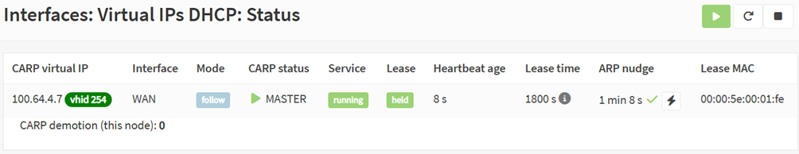
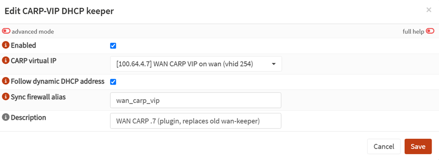
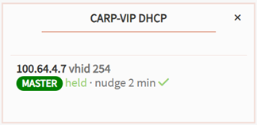

# os-carp-vip-dhcp

> **Give a CARP virtual IP its own DHCP lease - so a shared, failover service IP works on a DHCP-assigned WAN.**

[](https://opnsense.org/)
[](LICENSE)
[](https://github.com/toreamun/opnsense-plugins)
[](https://buymeacoffee.com/toreamun)

An independent OPNsense plugin by [@toreamun](https://github.com/toreamun). *(Sources live in [`net/os-carp-vip-dhcp/`](net/os-carp-vip-dhcp/); the repo mirrors the [opnsense/plugins](https://github.com/opnsense/plugins) ports-tree layout so it builds with the standard tooling.)*

---

## What it does

On a **DHCP-assigned WAN**, the ISP only routes an address while it holds a **live DHCP lease** bound to a MAC. A plain CARP virtual IP is *static* - it never gets a lease, so it never receives traffic.

This plugin runs a small daemon that keeps a DHCP lease alive **for the CARP VIP's virtual MAC**. The ISP then routes the VIP to that MAC, native OPNsense CARP handles ARP and failover as usual, and the shared IP works - and fails over between two nodes - on a dynamic line. It works whether the ISP hands out several addresses or, via a **lab-validated** single-IP design, [only one](net/os-carp-vip-dhcp/docs/single-ip-wan-carp.md).

<p align="center">
  <br>
  <sub><i>The Status page - the VIP holding its lease as CARP <b>master</b>, with gateway reachability confirmed (green check).</i></sub>
</p>

> **Status: independent plugin, aiming for the official tree.** This is a standalone plugin, not (yet) part of OPNsense. **If enough people find it useful, I intend to propose it for the official OPNsense community plugins** - ⭐ [star the repo](https://github.com/toreamun/opnsense-plugins) if you'd like to see that happen.

## Is this for you?

You need it if **both** of these are true:

- ✅ An **HA pair** (two OPNsense nodes) sharing an IP via **CARP**.
- ✅ The WAN is addressed by the **ISP's DHCP** (not static, not PPPoE).

**The plugin supports both DHCP shapes** - however many addresses your line hands out:

- **Several concurrent leases** (one per node's WAN + one for the VIP) - the straightforward setup. Any such line works; tested on a plain public-DHCP WAN and behind CGNAT (the CGNAT line under test leased several addresses - behaviour varies by carrier).
- **Only one ISP address** - supported too. A single floating VIP holds the lease while each node uses a private WAN IP for CARP; the backup reaches the internet through the master. **Lab-validated** (not yet field-run on a live one-IP line) - full design in [net/os-carp-vip-dhcp/docs/single-ip-wan-carp.md](net/os-carp-vip-dhcp/docs/single-ip-wan-carp.md).

If your WAN is static or PPPoE, you don't need this plugin.

## Getting started

On the OPNsense box, as **root**:

1. **Create a CARP VirtualIP** on the WAN (Interfaces ‣ Virtual IPs).
2. **Install:** resolves the latest signed release, verifies its maintainer signature, and installs Scapy + the plugin:
   ```sh
   fetch -o - https://raw.githubusercontent.com/toreamun/opnsense-plugins/main/install.sh | sh
   ```
   *(Trust note: this bootstrap runs as **root before it can verify itself** - trust-on-first-use over GitHub TLS, since the signature check it performs lives inside the as-yet-unverified script. To establish trust yourself instead, use the verified **Manual install** or **Build from source** paths below.)*
3. Open **Interfaces ‣ Virtual IPs DHCP**, add a **keeper** (a per-VIP lease-holder) pointing at that CARP VIP, and **enable** it. *(The VIP dropdown lists your CARP VIPs - if it's empty you skipped step 1; a keeper needs an existing CARP VIP to point at. And a keeper does nothing until its **Enabled** box is ticked.)*

That's it - the VIP now holds a live lease. The defaults are sensible: it follows a dynamic address, keeps the gateway's ARP fresh, and runs on both nodes for seamless failover.

**Point your traffic at the VIP.** Keeping the lease alive is only half the job: to actually *use* the failover-capable VIP, your NAT and rules must reference **it**, not a single node's own WAN address:

- **Source NAT** *(recommended for HA; required for a single-IP WAN)*: set **Firewall ‣ NAT ‣ Source NAT** to translate to the **CARP VIP**, so outbound connections source from the VIP and keep working after a failover (a rule left translating to the node's own WAN IP does not fail over). *(Set this on the **Source NAT** page. The same menu also has a legacy **Outbound** page - both are present on 26.1 and 26.7 and either works.)*
- **Dynamic address?** Set **Sync firewall alias** on the keeper and point Source NAT - and any rule that must follow - at that **alias** instead of a literal IP, so it tracks the address automatically on a follow. See *Following a dynamic address* below.

**You'll know it's working when**, on the **Status** page (or the dashboard widget): the keeper shows **bound** to the VIP's address, the node it runs on is CARP **master**, and gateway reachability shows a **green check** (the gateway is answering the ARP nudge). On the backup you'll instead see it **standing by** (or holding its own lease, depending on mode) - that's expected. A persistent problem raises a **dashboard banner**.

- **Update:** re-run the exact same command (it always fetches the latest signed release and reinstalls in place; settings are preserved). Pin a version by appending its tag, e.g. `… | sh -s -- os-carp-vip-dhcp v1.4.0`.
- **Uninstall:** `pkg delete os-carp-vip-dhcp` - stops the daemons and cleans up (Scapy is left in place). *(A manual, no-script install is documented below.)*

## Where it lives in the GUI

Everything is under **Interfaces ‣ Virtual IPs DHCP**:

| Page | What you get |
|---|---|
| **Settings** | add / edit / enable keepers |
| **Status** | live per-keeper state - lease, CARP role, heartbeat, ARP-nudge age + gateway reachability |
| **Log** | the keeper log (searchable, with a level filter) |

A **“CARP-VIP DHCP” dashboard widget** shows one row per keeper for an at-a-glance view. Access is granted by the **“Interfaces: Virtual IPs DHCP”** privilege.

<p align="center">
  
  &nbsp;&nbsp;
  <br>
  <sub><i>Adding a keeper (left) and the dashboard widget (right).</i></sub>
</p>

## How it works

A small root daemon keeps a DHCP lease alive for a chosen `chaddr` - the CARP virtual MAC (`00:00:5e:00:01:<vhid>`, last octet = the vhid in hex) of an existing CARP VIP. Standard `dhclient` can't do this because it ties the DHCP `chaddr` to the interface's hardware MAC; the daemon decouples them via a raw L2 socket (Scapy).

Once the ISP routes the VIP address to that MAC, native OPNsense CARP answers ARP and egresses data as usual - so the VIP becomes failover-capable on a DHCP interface. The daemon references an existing CARP VirtualIP (deriving interface, vhid-to-chaddr and IP), follows the lease (RENEW at T1, REBIND at T2, re-DORA - a full Discover-Offer-Request-Ack - at expiry), and by default runs on **both** nodes redundantly - same lease, seamless failover, no split-brain. Because the lease lives on the CARP **virtual** MAC, a failover invalidates nothing upstream: the same MAC simply starts answering from the new master.

## Single-IP WAN (only one public IP)

Only *one* public IP on the WAN? You still get CARP failover. The shape:

- each node takes a small **private** static WAN IP (used only for CARP advertisements + node identity);
- **one floating CARP VIP** holds the single public lease - this plugin keeps it alive on the virtual MAC;
- a **gateway group** routes the backup's own traffic out through the master over the SYNC link.

This is the **mental model, not a setup checklist** - single-IP needs the private node IPs, a gateway group, and the SYNC link wired correctly, and each mechanism is lab-validated individually but the whole stack has not yet been field-run on a live one-IP line. Don't build it from these three bullets alone: the full recipe (IP plan, failover flow, GUI steps, lab-validation status) is in **➜ [Single-IP WAN failover](net/os-carp-vip-dhcp/docs/single-ip-wan-carp.md)**.

---

<details>
<summary><b>Options &amp; behaviour</b></summary>

All per-keeper; sensible defaults mean most setups only pick a CARP VIP and enable.

- **Follow a dynamic address** *(default on)*: if the server assigns a different address than the configured VIP, the keeper adopts it and rewrites the CARP VIP to match, so the VIP stays online on a dynamic line. Turn **off** to *enforce* a fixed reservation (a mismatch then alarms).
- **Sync a firewall alias** *(optional)*: name a Host alias and the plugin keeps it set to the VIP's current address, so Source NAT and rules pointed at the alias follow a dynamic address. See *Following a dynamic address*.
- **ARP nudge** *(default on)*: keeps the upstream gateway's ARP entry for the VIP fresh and listens for the reply as a reachability signal. See *ARP nudge &amp; reachability*.
- **CARP failover on lease loss** *(optional)*: demote this node (hand the VIP to the peer) if the keeper stops holding the correct lease.
- **DHCP identity options** *(advanced)*: set a vendor-class (opt 60), client-id (61) or hostname (12) for servers that only lease to a known value. On a server that keys the lease on the **client-id** (not the chaddr), **both HA nodes must present the *same* client-id** - a divergent one gets them different addresses and breaks the shared VIP. HA config-sync keeps it identical.
- **Capture backend** *(advanced, experimental)*: pick the packet-capture engine per keeper: **Default** (follow the host-wide `carpvipdhcp_backend` rc.conf flag if set, else Scapy), **scapy**, or **bpf** (the dependency-free raw `/dev/bpf` backend). Lets a bpf rollout be staged one VIP at a time; leave on Default unless you are testing bpf.
- **HA config sync** *(optional)*: replicate the keeper config to the peer (System ‣ High Availability ‣ Settings), so you configure once on the master. Safe: the config is node-agnostic.
- **Self-healing & health banner:** the daemon never exits on a transient fault (it keeps its heartbeat fresh so CARP doesn't falsely demote the node), and a GUI banner warns if any enabled keeper stops holding its lease - closing the silent-failure gap on a redundant spare.

</details>

<details>
<summary><b>ARP nudge &amp; reachability</b></summary>

Some ISP gateways/BNGs ignore gratuitous ARP and **never re-ARP an expired entry**. The symptom: traffic to the VIP works right after a CARP event or DHCP exchange, then **silently blackholes** minutes later. A DHCP RENEW doesn't refresh such a gateway's ARP cache, but a received ARP *request* does.

- **The nudge:** a periodic ARP *request* from the VIP (source = leased IP + CARP MAC) for the gateway. Default 120 s - comfortably under the ARP timeout of typical *and* shorter-lived gateway caches, at one negligible broadcast per interval. Lower it toward the 30 s floor for gear with a very short ARP timeout. Sent **only while CARP master** (never from a backup). Set 0 to disable.
- **On becoming master** (failover or a link flap re-electing CARP): an immediate nudge **and** an early lease RENEW, within ~1 s of the kernel CARP transition - neither waits for its timer.
- **Manual nudge:** the ⚡ button on the Status page (shown on the master), or `kill -USR1` on the daemon.
- **Reachability:** the keeper watches for the gateway's ARP **reply**; the Status page/widget show a green check when confirmed. If the gateway stops answering **while the lease is held** - the silent return-path blackhole this whole feature guards against - a **dashboard banner** is raised (it is otherwise invisible: CARP still masters and the lease is still held). No promiscuous mode is needed - the master already accepts the VIP MAC. A NIC that filters non-primary unicast can enable the advanced **“ARP listen in promiscuous mode”** fallback *(default off; it warns when on)*.

</details>

<details>
<summary><b>Following a dynamic address (NAT, aliases, inbound, HA)</b></summary>

When **Follow dynamic DHCP address** is on (default) and the server assigns a different address, the plugin rewrites the CARP VirtualIP to the new address. Both HA nodes reach the same address independently - they share the CARP `chaddr` and the server issues one lease per `chaddr`, so no cross-node signalling is needed.

**Make NAT and rules follow** - the plugin rewrites the *VIP address*, not your rules:

1. In the keeper, set **Sync firewall alias** to a name (e.g. `wan_carp_vip`). The plugin creates a Host alias of that name and keeps it equal to the VIP's current address.
2. Point your **Source NAT** translation address - and any rule that must follow - at that **alias** instead of a literal IP. On a follow, the plugin updates the alias and reapplies the filter (state-preserving), so rules track the new address.


The alias is created/updated automatically and never deleted (it may be referenced elsewhere).

A follow also runs the system's **newwanip hooks** for the VIP's interface, so consumers such as dynamic DNS and VPN endpoints learn the new address the same way they would after a native lease change.

**Inbound is different:** a **port-forward cannot follow** a dynamic address - the upstream only routes inbound to the address it has reserved. Follow keeps *outbound* online; inbound services need a stable reserved address.

A **cross-subnet** renumber is handled too: when the ACK moves the gateway, the plugin also updates the VIP prefix and the WAN gateway from the ACK's subnet mask and gateway, and reapplies routing. The one gap left is an ACK that changes the gateway **without** carrying a subnet mask: then only the address moves, and the keeper logs a loud warning to fix the interface prefix and System > Gateways by hand.

**HA note:** firewall aliases are covered by OPNsense HA config sync, so an alias update propagates to the backup too. The CARP VIP itself is intentionally *not* synced (`advskew` differs per node).

</details>

<details>
<summary><b>Playing nicely with ISP access-network security</b></summary>

Carrier access gear (BNG / access switches / OLTs) polices subscribers with mechanisms that key off the DHCP exchange. The plugin's strategy - a real lease held on the CARP virtual MAC, plus an ARP nudge that repeats exactly that binding - is designed to satisfy each:

| ISP mechanism | What it does | How the plugin cooperates |
|---|---|---|
| **DHCP snooping** | builds the trusted IP↔MAC table from DHCP seen on the port | the lease is acquired/renewed through the subscriber port with `chaddr` = CARP MAC, matching what CARP presents |
| **Dynamic ARP Inspection** | drops ARP whose (IP, MAC) ≠ the snooped binding | the nudge's sender is exactly (leased IP, CARP MAC) - it passes |
| **Gratuitous-ARP filtering** | ignores unsolicited ARP (drops CARP's own gratuitous ARP) | the nudge is a normal ARP **request**, which the gateway must process to answer - the one path such gear learns from |
| **No re-ARP on expiry** | gateway never re-ARPs; an expired entry blackholes traffic | the periodic nudge keeps the entry permanently fresh; becoming master nudges immediately |
| **IP Source Guard** (IP-only) | drops source IPs not in the binding table | the leased VIP is in the table - fine |
| **IP Source Guard** (strict IP+MAC) | also requires the source MAC to match | ⚠️ **generic FreeBSD-CARP behaviour, not specific to this plugin:** FreeBSD egresses *any* CARP VIP's data with the interface's *physical* MAC (a plain static-IP CARP VIP behaves identically), so strict IP+MAC IPSG drops it - ARP/pings *to* the VIP work, but nothing *sourced from* it. A static MAC spoof backfires in an HA pair (both nodes share the MAC, so a permanent flap). A CARP-state-driven spoof (only the master adopts the CARP MAC) fixes it - lab-validated as a concept - but that's a generic CARP concern best handled upstream/in core or a dedicated add-on, not in a DHCP-lease keeper |
| **SAVI** (RFC 7513) | the standardized form of snooping + source guard: binds each source IP to a *binding anchor* (the attachment port, or port + MAC) learned from the DHCP exchange, then drops data and ARP whose source has no live binding on that anchor | on the usual topology both HA nodes sit behind the **one subscriber port**, so the anchor, MAC and IP stay constant across failover, no anchor move, no rebind, no drop. The binding's lifetime tracks the **lease**, so the VIP passes source-guard filtering only while a live lease backs it, which is precisely what the keeper maintains; holding an address locally past its lease would not pass |
| **Client identity checks** | leases only to a known vendor-class/client-id/hostname | per-keeper DHCP identity options |
| **Per-subscriber MAC/session limits** | limits source MACs / DHCP sessions on the port | budget for each node's physical MAC **plus** the CARP MAC. A strict *one-MAC-per-port* line can't be satisfied - both nodes' physical MACs still reach the uplink (CARP multicast) |

**When the access gateway refuses a MAC.** The BNG can decline a client MAC with nothing wrong on your side: subscriber management enforces per-line host/lease caps, and a stuck or corrupted per-subscriber session (for instance after an upstream access-network fault) can occupy the slot. The signature is distinctive: a REQUEST for the known address gets a **NAK**, a DISCOVER gets **silence**, yet another MAC leases fine on the same line. The keeper's INIT-REBOOT-first startup surfaces exactly this in the log as *reachable but refused*: the NAK round-trip proves the server hears the MAC and is saying no, so the line is not dead and the client is not broken. Seen in a real ISP incident: when the log shows this pattern, the fix lives in the ISP's subscriber management, not in local configuration. The keeper keeps retrying and binds automatically once the line re-admits the MAC.

</details>

<details>
<summary><b>Scope, caveats &amp; design notes</b></summary>

- **IPv4 DHCP only.** DHCPv6 / IPv6 Neighbor Discovery are out of scope. The v6 side (e.g. a DHCPv6-PD prefix) does **not** float with the VIP, so after an IPv4 failover expect broken/asymmetric IPv6 on the surviving node until it re-acquires - plan v6 HA separately.
- WAN is the typical - not required - placement.
- Requires **root** (raw L2/BPF socket) and depends on **Scapy**. An experimental `bpf` capture backend (since 1.9.0) runs on a raw `/dev/bpf` descriptor with no Scapy dependency: opt in per host with `sysrc carpvipdhcp_backend=bpf` plus a service restart, or per keeper via the **Capture backend** field on the settings dialog (since 1.10.0). Remove the variable (`sysrc -x carpvipdhcp_backend`) or set the field back to **Default** to return to the default Scapy backend.
- **Shared-L2 exposure:** follow mode trusts the DHCP ACK, so on a genuinely shared segment a neighbour who can read the CARP adverts could forge one to relocate the VIP (the same untrusted-shared-L2 risk a plain firewall shares). Moot where the ISP isolates you per VLAN/port; pin the address (follow off) on a shared L2 otherwise.

*Deliberately not included:* DHCP option 82 (inserted by the ISP, not the client); RFC 5227 address-conflict detection/arbitration (a rogue host claiming the VIP is beyond a subscriber device's control); DAI rate-limit pacing (one nudge / 120 s is orders of magnitude under any limit); a unicast-RENEW mode (the broadcast flag makes RFC-2131 servers broadcast OFFER/ACK to a non-promiscuous socket; a server that unicasts to the CARP MAC is still received on the master).

</details>

<details>
<summary><b>Manual install (step by step, no script)</b></summary>

As **root**, download the plugin `.pkg`, `SHA256SUMS` and `SHA256SUMS.sig` from the [latest release](https://github.com/toreamun/opnsense-plugins/releases/latest) into an empty directory, then:

```sh
# 1. Fetch the maintainer's public key (one-time).
fetch -o release.pub https://raw.githubusercontent.com/toreamun/opnsense-plugins/main/keys/release.pub

# 2. Verify the checksum manifest was signed by that key.
openssl base64 -d -in SHA256SUMS.sig -out SHA256SUMS.sig.bin
openssl dgst -sha256 -verify release.pub -signature SHA256SUMS.sig.bin SHA256SUMS   # -> Verified OK

# 3. Verify the package matches the signed manifest.
h=$(sha256 -q os-carp-vip-dhcp-*.pkg); grep -q "$h" SHA256SUMS && echo "package OK"

# 4. Install the Scapy dependency (package name follows your box's Python version).
pkg install -y "py3$(python3 -c 'import sys; print(sys.version_info.minor)')-scapy"

# 5. Install the plugin.
pkg add ./os-carp-vip-dhcp-*.pkg
```

</details>

<details>
<summary><b>Build from source (run the latest, or don't rely on a release)</b></summary>

For testers who want the latest `main` (e.g. an unreleased fix) or anyone who would rather build inspected source than trust the signed release. The plugin has no compiled code - "build" just packages the files - but it uses the OPNsense plugin build tooling, so run it on an OPNsense box (or an OPNsense build VM).

```sh
# 1. Clone (this is the "download" - main for latest, or check out a tag).
git clone https://github.com/toreamun/opnsense-plugins
cd opnsense-plugins            # inspect the source you're about to run

# 2. Build + install, as root. Fetches the official plugins tree for the build
#    tooling, packages net/os-carp-vip-dhcp, ensures Scapy, and pkg-adds it.
./build.sh --install
```

`./build.sh` on its own only builds `./dist/<pkg>.pkg` (no install) - use that to build on a separate box and copy just the `.pkg` to a hardened firewall (keeping the build toolchain off it). Settings survive a reinstall; re-run the one-line `install.sh` any time to return to signed releases.
</details>

## Verifying releases

`pkg add` does not verify a standalone package, so each release also ships a signed checksum manifest (`SHA256SUMS` + `SHA256SUMS.sig`). Verify it on the OPNsense box before installing:

```sh
# one-time: fetch the maintainer public key
fetch -o release.pub https://raw.githubusercontent.com/toreamun/opnsense-plugins/main/keys/release.pub

# with the release's *.pkg, SHA256SUMS and SHA256SUMS.sig in the current dir:
openssl base64 -d -in SHA256SUMS.sig -out SHA256SUMS.sig.bin
openssl dgst -sha256 -verify release.pub -signature SHA256SUMS.sig.bin SHA256SUMS   # -> Verified OK

# check each package against the signed manifest (format-agnostic: match by hash)
for p in *.pkg; do grep -q "$(sha256 -q "$p")" SHA256SUMS && echo "$p: OK" || echo "$p: MISMATCH"; done
```

`Verified OK` proves the manifest was signed with the maintainer key; the diff proves each `.pkg` matches the signed manifest. OPNsense packages use a wildcard ABI, so one build works across OPNsense versions.

## For maintainers

- **Building & releasing:** see **[RELEASE.md](RELEASE.md)** for the build, sign, tag and publish process and the review gates each release passes. Packages must be built **on an OPNsense box** - GitHub Actions has no OPNsense/FreeBSD runner, and the dependency name differs from stock FreeBSD (OPNsense 26.x uses `py313-scapy`).
- **Linting:** Python is PEP 8, max line length 120 (`flake8`, config in [setup.cfg](setup.cfg)); PHP is PSR-12 (`phpcs`). Run everything locally with [pre-commit](.pre-commit-config.yaml) (`pre-commit install && pre-commit run --all-files`); CI ([.github/workflows/lint.yml](.github/workflows/lint.yml)) runs the same checks on every push and PR.

## License

BSD-2-Clause. See [LICENSE](LICENSE).
