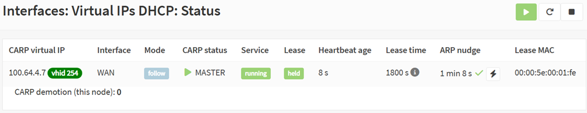
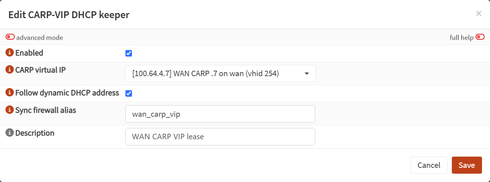
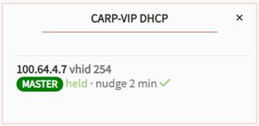

# os-carp-vip-dhcp

> **Give a CARP virtual IP its own DHCP lease - so a shared, failover service IP works on a DHCP-assigned WAN.**

[](https://opnsense.org/)
[](LICENSE)
[](https://github.com/toreamun/opnsense-plugins)
[](https://buymeacoffee.com/toreamun)

On a **DHCP-assigned WAN**, the ISP only routes an address while it holds a **live DHCP lease** bound to a MAC. A plain CARP virtual IP is *static* - it never gets a lease, so it never receives traffic. That is why OPNsense HA "just works" on a static WAN and falls apart on a DHCP one.

This plugin closes that gap. A small daemon keeps a DHCP lease alive **for the CARP VIP's virtual MAC**, so the ISP routes the VIP to that MAC, native OPNsense CARP handles ARP and failover as usual, and the shared IP works - and fails over between two nodes - on a dynamic line. It works whether the ISP hands out several addresses or [only one](net/os-carp-vip-dhcp/docs/single-ip-wan-carp.md).

<p align="center">
  <br>
  <sub><i>The Status page - the VIP holding its lease as CARP <b>master</b>, with gateway reachability confirmed (green check).</i></sub>
</p>

## Is this for you?

You need it if **both** are true:

- ✅ You run (or want to run) an **HA pair** - two OPNsense nodes sharing an IP via **CARP**.
- ✅ The WAN is addressed by the **ISP's DHCP** (not static, not PPPoE).

And, as for any CARP setup, both nodes' WAN ports must share one L2 segment with the ISP hand-off (a switch in front of the pair).

Both DHCP shapes are supported:

- **Several concurrent leases** (one per node's WAN + one for the VIP): the straightforward setup. Tested on a plain public-DHCP WAN and behind CGNAT.
- **Only one ISP address**: a single floating VIP holds the lease while each node uses a private WAN IP for CARP. Field-validated on a live single-IP line, including a real failover. Full design in the [Single-IP WAN guide](net/os-carp-vip-dhcp/docs/single-ip-wan-carp.md).

If your WAN is static or PPPoE, you don't need this plugin. It targets current OPNsense releases (26.x) and is pure Python over the standard library, so there is nothing else to install.

## Getting started

Five steps; only the install command needs a root shell, the rest is GUI. Start with one node; add the peer when the first one holds its lease.

1. **Create a CARP VirtualIP** on the WAN under **Interfaces ‣ Virtual IPs** (OPNsense's [CARP how-to: Setup Virtual IPs](https://docs.opnsense.org/manual/how-tos/carp.html#setup-virtual-ips)). IPv4 only. You don't need to know the leased address yet: enter your current public WAN address, or any IPv4 placeholder; with Follow on (the default) the keeper rewrites it to whatever the ISP leases. The plugin points at an existing CARP VIP, so the keeper's VIP dropdown is empty until you do this.
2. **Install** the latest signed release:
   ```sh
   fetch -o - https://raw.githubusercontent.com/toreamun/opnsense-plugins/main/install.sh | sh
   ```
   The script resolves the latest release, verifies the maintainer signature on its checksum manifest, and installs the package. Prefer to establish trust yourself? Use the verified [manual install](#manual-install) or [build from source](#build-from-source) below.
3. **Add a keeper** under **Interfaces ‣ Virtual IPs DHCP**: pick the CARP VIP, tick **Enabled**, save and apply. The defaults are right for most lines: it follows a dynamic address, keeps the gateway's ARP fresh, and runs on both nodes for seamless failover.
4. **Point your traffic at the VIP.** Keeping the lease alive is half the job; your NAT must *use* the failover-capable address. Under **Firewall ‣ NAT ‣ Source NAT**, translate outbound traffic to the **CARP VIP** (a rule left on the node's own WAN address does not fail over). On a **dynamic** address, set **Sync firewall alias** on the keeper and translate to that alias instead of a literal IP, so NAT follows the address automatically. See OPNsense's [CARP how-to: Setup outbound NAT](https://docs.opnsense.org/manual/how-tos/carp.html#setup-outbound-nat) and *Following a dynamic address* below.
5. **Check the Status page** (or the dashboard widget). Working looks like the screenshot above: **Lease** says **held**, **CARP status** is **MASTER**, and the **ARP nudge** column shows a **green check** (the gateway answers the nudge). On the backup node, Lease is also **held** (both nodes keep the same lease warm), CARP status is **BACKUP**, and ARP nudge shows **never** (or the age of its last nudge as master) with no check mark, since only the master nudges - that's expected. A persistent problem raises a **dashboard banner**, so a silent failure on the spare cannot go unnoticed.

- **Update:** re-run the same install command. It always fetches the latest signed release and reinstalls in place; settings are preserved. To pin a release, append its tag from the [releases page](https://github.com/toreamun/opnsense-plugins/releases):
  ```sh
  fetch -o - https://raw.githubusercontent.com/toreamun/opnsense-plugins/main/install.sh | sh -s -- os-carp-vip-dhcp vX.Y.Z
  ```
- **Uninstall:** `pkg delete os-carp-vip-dhcp` stops the daemons and removes the package and its runtime files. The keeper settings stay in `config.xml` (so a reinstall finds them again) and the keeper logs are kept.
- **Help:** [open an issue](https://github.com/toreamun/opnsense-plugins/issues) with the keeper log (**Interfaces ‣ Virtual IPs DHCP ‣ Log**) and your ISP/line type. Report security issues privately as described in [SECURITY.md](SECURITY.md).

> **Trust note on the one-liner.** The bootstrap script runs as root before it can verify itself (trust-on-first-use over GitHub TLS; the signature check it performs lives inside the as-yet-unverified script). The [manual install](#manual-install) path verifies everything before anything runs.

## Where it lives in the GUI

Everything is under **Interfaces ‣ Virtual IPs DHCP**:

| Page | What you get |
|---|---|
| **Settings** | add / edit / enable keepers |
| **Status** | live per-keeper state - lease, CARP role, heartbeat, ARP-nudge age + gateway reachability |
| **Log** | the keeper log (searchable, with a level filter) |

A **"CARP-VIP DHCP" dashboard widget** shows one row per keeper for an at-a-glance view. Access is granted by the **"WebCfg - Interfaces: Virtual IPs DHCP"** privilege.

<p align="center">
  
  &nbsp;&nbsp;
  <br>
  <sub><i>Adding a keeper (left) and the dashboard widget (right).</i></sub>
</p>

## How it works

A small root daemon keeps a DHCP lease alive for a chosen `chaddr` - the CARP virtual MAC (`00:00:5e:00:01:<vhid>`, last octet = the vhid in hex) of an existing CARP VIP. Standard `dhclient` can't do this because it ties the DHCP `chaddr` to the interface's hardware MAC; the daemon decouples them via a raw `/dev/bpf` socket.

Once the ISP routes the VIP address to that MAC, native OPNsense CARP answers ARP and egresses data as usual - so the VIP becomes failover-capable on a DHCP interface. The daemon references an existing CARP VirtualIP (deriving interface, vhid-to-chaddr and IP), follows the lease (RENEW at T1, REBIND at T2, re-DORA - a full Discover-Offer-Request-Ack - at expiry), and by default runs on **both** nodes redundantly - same lease, seamless failover, no split-brain. Because the lease lives on the CARP **virtual** MAC, a failover invalidates nothing upstream: the same MAC simply starts answering from the new master.

## Single-IP WAN (only one public IP)

Only *one* public IP on the WAN? You still get CARP failover:

- each node takes a small **private** static WAN IP (used only for CARP advertisements + node identity);
- **one floating CARP VIP** holds the single public lease - this plugin keeps it alive on the virtual MAC;
- outbound NAT translates to the VIP, so failover needs no routing change.

For the default route there are two designs, both documented. The **baseline** keeps the default pinned to the ISP gateway on both nodes; the backup has no internet of its own until it is promoted, and borrows the master's path on demand when it needs updates. The **role-driven** design lets the master **own the default route by CARP role** (enforce) and gives the backup automatic internet through the master via the built-in **backup egress** feature; pick it when you want the backup online, or when a dynamic router redistributes your default. Neither uses an auto-switching gateway group, which lags failover and blackholes a promoted node.

This is the mental model, not a setup checklist: single-IP needs the private node IPs, the SYNC link and the NAT wired correctly, and the ISP has to lease to the virtual MAC (there is a safe pre-flight test). The click-by-click recipe, IP plan, failover flow and validation status are in **➜ [Single-IP WAN failover](net/os-carp-vip-dhcp/docs/single-ip-wan-carp.md)**.

## Going further

<details>
<summary><b>Options &amp; behaviour</b></summary>

All per-keeper; sensible defaults mean most setups only pick a CARP VIP and enable.

- **Follow dynamic DHCP address** *(default on)*: if the server assigns a different address than the configured VIP, the keeper adopts it and rewrites the CARP VIP to match, so the VIP stays online on a dynamic line. Turn **off** to *enforce* a fixed reservation (a mismatch then alarms).
- **Sync firewall alias** *(optional)*: name a Host alias and the plugin keeps it set to the VIP's current address, so Source NAT and rules pointed at the alias follow a dynamic address. See *Following a dynamic address*.
- **ARP nudge** *(default on)*: keeps the upstream gateway's ARP entry for the VIP fresh and listens for the reply as a reachability signal. See *ARP nudge &amp; reachability*.
- **CARP failover on lease loss** *(optional, only with Follow off)*: demote this node (hand the VIP to the peer) if the keeper stops holding the correct lease. A following keeper adopts a new address instead of losing its lease, so the two are mutually exclusive.
- **DHCP vendor class / DHCP client-id / DHCP hostname** *(advanced)*: set option 60, 61 or 12 for servers that only lease to a known value. On a server that keys the lease on the **client-id** (not the chaddr), **both HA nodes must present the *same* client-id** - a divergent one gets them different addresses and breaks the shared VIP. HA config-sync keeps it identical.
- **Own default route by CARP role** *(advanced, default off)*: one keeper owns the IPv4 default route as a function of CARP role and lease, so a failover moves the default with the role instead of leaving a backup black-holing traffic. Modes **observe** (log only) and **enforce**. See *Owning the default route by CARP role* below.
- **Backup egress (internet while not master)** *(advanced, default off; needs the default-route mode above set to observe/enforce)*: once the master owns the default route, the backup has no WAN route of its own, so its own traffic (updates, NTP, DNS, remote access) has nowhere to go. This routes the backup's egress to the master via a leak-safe /1-split (or a configured prefix list) and withdraws it on promotion to master. See the [backup egress guide](net/os-carp-vip-dhcp/docs/backup-egress.md).
- **HA config sync** *(optional)*: replicate the keeper config to the peer (System ‣ High Availability ‣ Settings), so you configure once on the master. Safe: the config is node-agnostic.
- **Self-healing & health banner:** the daemon never exits on a transient fault (it keeps its heartbeat fresh so CARP doesn't falsely demote the node), and a GUI banner warns if any enabled keeper stops holding its lease - closing the silent-failure gap on a redundant spare.

</details>

<details>
<summary><b>ARP nudge &amp; reachability</b></summary>

Some ISP gateways/BNGs ignore gratuitous ARP and **never re-ARP an expired entry**. The symptom: traffic to the VIP works right after a CARP event or DHCP exchange, then **silently blackholes** minutes later. A DHCP RENEW doesn't refresh such a gateway's ARP cache, but a received ARP *request* does.

- **The nudge:** a periodic ARP *request* from the VIP (source = leased IP + CARP MAC) for the gateway. Default 120 s - comfortably under the ARP timeout of typical *and* shorter-lived gateway caches, at one negligible broadcast per interval. Lower it toward the 30 s floor for gear with a very short ARP timeout. Sent **only while CARP master** (never from a backup). Set 0 to disable.
- **On becoming master** (failover or a link flap re-electing CARP): an immediate nudge **and** an early lease RENEW, within ~1 s of the kernel CARP transition - neither waits for its timer.
- **Manual nudge:** the ⚡ button on the Status page (shown on the master), or `kill -USR1` on the daemon.
- **Reachability:** the keeper watches for the gateway's ARP **reply**; the Status page/widget show a green check when confirmed. If the gateway stops answering **while the lease is held** - the silent return-path blackhole this whole feature guards against - a **dashboard banner** is raised (it is otherwise invisible: CARP still masters and the lease is still held). No promiscuous mode is needed - the master already accepts the VIP MAC. A NIC that filters non-primary unicast can enable the advanced **"ARP listen in promiscuous mode"** fallback *(default off; it warns when on)*.

</details>

<details>
<summary><b>Following a dynamic address (NAT, aliases, inbound, HA)</b></summary>

When **Follow dynamic DHCP address** is on (default) and the server assigns a different address, the plugin rewrites the CARP VirtualIP to the new address. Both HA nodes reach the same address independently - they share the CARP `chaddr` and the server issues one lease per `chaddr`, so no cross-node signalling is needed.

**Make NAT and rules follow** - the plugin rewrites the *VIP address*, not your rules:

1. In the keeper, set **Sync firewall alias** to a name (e.g. `wan_carp_vip`). The plugin creates a Host alias of that name (or adopts a Host alias of that name you pre-created) and keeps it equal to the VIP's current address.
2. Point your **Source NAT** translation address - and any rule that must follow - at that **alias** instead of a literal IP. On a follow, the plugin updates the alias and reapplies the filter (state-preserving), so rules track the new address.

The alias is created/updated automatically and never deleted (it may be referenced elsewhere).

A follow also runs the system's **newwanip hooks** for the VIP's interface, so consumers such as dynamic DNS and VPN endpoints learn the new address the same way they would after a native lease change.

**Inbound is different:** a **port-forward cannot follow** a dynamic address - the upstream only routes inbound to the address it has reserved. Follow keeps *outbound* online; inbound services need a stable reserved address.

A **cross-subnet** renumber is handled too: when the ACK moves the gateway, the plugin also updates the VIP prefix and the WAN gateway from the ACK's subnet mask and gateway, and reapplies routing. The one gap left is an ACK that changes the gateway **without** carrying a subnet mask: then only the address moves, and the keeper logs a loud warning to fix the interface prefix and System > Gateways by hand.

**HA note:** firewall aliases are covered by OPNsense HA config sync, so an alias update propagates to the backup too. The CARP VIP itself is intentionally *not* synced (`advskew` differs per node).

</details>

<details>
<summary><b>Owning the default route by CARP role</b></summary>

On a single-IP CARP WAN, a backup node that still holds (or advertises) a default route can black-hole traffic - it has no live lease of its own, so its default leads nowhere useful. This option makes **one** keeper own the IPv4 default route (`0.0.0.0/0`) as a strict function of CARP role and lease, so the failure mode is a *withdrawn* default (fail-stop), never a black-holed one.

- **The rule:** the CARP **master** that holds this keeper's lease keeps a default via the **lease gateway** (DHCP option 3); every other state - backup, or master without a lease - keeps **none**. It is level-triggered and idempotent (it reconciles on each role/lease change and converges), and a failover moves the default with the role within ~1 s because it reacts to the CARP transition, not a slow poll.
- **Modes:** **off** *(default)* does nothing. **observe** logs the decision it *would* make without writing the routing table - run this first to watch the behaviour on your own box. **enforce** actually installs and withdraws the default.
- **With os-frr:** the default lives in the kernel FIB, so `redistribute kernel` makes the advertised default follow the CARP role for free - the backup stops advertising `0/0` instead of advertising a route it cannot honour. It also works **without** FRR (it just keeps the backup route-honest locally); the keeper makes no FRR calls.
- **Only one keeper may enforce** - there is a single default route, so two enforcing keepers would fight over it (the settings page rejects a second one). Others may still run in **observe**.
- **Pair with `force_down`:** OPNsense installs its own default from the WAN gateway unconditionally, which would fight the keeper. Mark the WAN gateway down (System ‣ Gateways, **Mark Gateway as Down**) so OPNsense installs no default and the keeper owns it cleanly. On a static single-IP WAN this changes only the default-route decision; gateway monitoring (RTT/loss) still runs. Roll it out gently: **observe** first, then **enforce** with `force_down`.

Part of the [Single-IP WAN failover](net/os-carp-vip-dhcp/docs/single-ip-wan-carp.md) picture.

</details>

<details>
<summary><b>Playing nicely with ISP access-network security</b></summary>

Carrier access gear (BNG / access switches / OLTs) polices subscribers with mechanisms that key off the DHCP exchange. The plugin's strategy - a real lease held on the CARP virtual MAC, plus an ARP nudge that repeats exactly that binding - is designed to satisfy each:

| ISP mechanism | What it does | How the plugin cooperates |
|---|---|---|
| **DHCP snooping** | builds the trusted IP↔MAC table from DHCP seen on the port | the lease is acquired/renewed through the subscriber port with `chaddr` = CARP MAC, matching what CARP presents |
| **Dynamic ARP Inspection** | drops ARP whose (IP, MAC) ≠ the snooped binding | the nudge's sender is exactly (leased IP, CARP MAC) - it passes |
| **Gratuitous-ARP filtering** | ignores unsolicited ARP (drops CARP's own gratuitous ARP) | the nudge is a normal ARP **request**, which the gateway must process to answer - the one path such gear learns from |
| **No re-ARP on expiry** | gateway never re-ARPs; an expired entry blackholes traffic | the periodic nudge keeps the entry permanently fresh; becoming master nudges immediately |
| **IP Source Guard** (IP-only) | drops source IPs not in the binding table | the leased VIP is in the table - fine |
| **IP Source Guard** (strict IP+MAC) | also requires the source MAC to match | ⚠️ **generic FreeBSD-CARP behaviour, not specific to this plugin:** FreeBSD egresses *any* CARP VIP's data with the interface's *physical* MAC (a plain static-IP CARP VIP behaves identically), so strict IP+MAC IPSG drops it - ARP/pings *to* the VIP work, but nothing *sourced from* it. A static MAC spoof backfires in an HA pair (both nodes share the MAC, so a permanent flap). A CARP-state-driven spoof (only the master adopts the CARP MAC) fixes it - lab-validated as a concept - but that's a generic CARP concern best handled upstream/in core or a dedicated add-on, not in a DHCP-lease keeper |
| **SAVI** (RFC 7513) | the standardized form of snooping + source guard: binds each source IP to a *binding anchor* (the attachment port, or port + MAC) learned from the DHCP exchange, then drops data and ARP whose source has no live binding on that anchor | on the usual topology both HA nodes sit behind the **one subscriber port**, so the anchor, MAC and IP stay constant across failover, no anchor move, no rebind, no drop. The binding's lifetime tracks the **lease**, so the VIP passes source-guard filtering only while a live lease backs it, which is precisely what the keeper maintains; holding an address locally past its lease would not pass |
| **Client identity checks** | leases only to a known vendor-class/client-id/hostname | per-keeper DHCP identity options |
| **Per-subscriber MAC/session limits** | limits source MACs / DHCP sessions on the port | budget for each node's physical MAC **plus** the CARP MAC. A strict *one-MAC-per-port* line can't be satisfied - both nodes' physical MACs still reach the uplink (CARP multicast) |

**When the access gateway refuses a MAC.** The BNG can decline a client MAC with nothing wrong on your side: subscriber management enforces per-line host/lease caps, and a stuck or corrupted per-subscriber session (for instance after an upstream access-network fault) can occupy the slot. The signature is distinctive: a REQUEST for the known address gets a **NAK**, a DISCOVER gets **silence**, yet another MAC leases fine on the same line. The keeper's INIT-REBOOT-first startup surfaces exactly this in the log as *reachable but refused*: the NAK round-trip proves the server hears the MAC and is saying no, so the line is not dead and the client is not broken. Seen in a real ISP incident: when the log shows this pattern, the fix lives in the ISP's subscriber management, not in local configuration. The keeper keeps retrying and binds automatically once the line re-admits the MAC.

</details>

<details>
<summary><b>Scope, caveats &amp; design notes</b></summary>

- **IPv4 DHCP only.** DHCPv6 / IPv6 Neighbor Discovery are out of scope. The v6 side (e.g. a DHCPv6-PD prefix) does **not** float with the VIP, so after an IPv4 failover expect broken/asymmetric IPv6 on the surviving node until it re-acquires - plan v6 HA separately.
- WAN is the typical - not required - placement.
- Requires **root** (raw L2/BPF socket). Runs on a raw `/dev/bpf` descriptor with no third-party dependency (pure Python stdlib).
- **Shared-L2 exposure:** follow mode trusts the DHCP ACK, so on a genuinely shared segment a neighbour who can read the CARP adverts could forge one to relocate the VIP (the same untrusted-shared-L2 risk a plain firewall shares). Moot where the ISP isolates you per VLAN/port; pin the address (follow off) on a shared L2 otherwise.

*Deliberately not included:* DHCP option 82 (inserted by the ISP, not the client); RFC 5227 address-conflict detection/arbitration (a rogue host claiming the VIP is beyond a subscriber device's control); DAI rate-limit pacing (one nudge / 120 s is orders of magnitude under any limit); a unicast-RENEW mode (the broadcast flag makes RFC-2131 servers broadcast OFFER/ACK to a non-promiscuous socket; a server that unicasts to the CARP MAC is still received on the master).

</details>

## Installing without the one-liner

<a id="manual-install"></a>

<details>
<summary><b>Manual install (verified, step by step)</b></summary>

`pkg add` does not verify a standalone package, so each release also ships a signed checksum manifest (`SHA256SUMS` + `SHA256SUMS.sig`). As **root**, download the plugin `.pkg`, `SHA256SUMS` and `SHA256SUMS.sig` from the [latest release](https://github.com/toreamun/opnsense-plugins/releases/latest) into an empty directory, then:

```sh
# 1. Fetch the maintainer's public key (one-time).
fetch -o release.pub https://raw.githubusercontent.com/toreamun/opnsense-plugins/main/keys/release.pub

# 2. Verify the checksum manifest was signed by that key.
openssl base64 -d -in SHA256SUMS.sig -out SHA256SUMS.sig.bin
openssl dgst -sha256 -verify release.pub -signature SHA256SUMS.sig.bin SHA256SUMS   # -> Verified OK

# 3. Verify the package matches the signed manifest (format-agnostic: match by hash).
for p in *.pkg; do grep -q "$(sha256 -q "$p")" SHA256SUMS && echo "$p: OK" || echo "$p: MISMATCH"; done

# 4. Install the plugin.
pkg add ./os-carp-vip-dhcp-*.pkg
```

`Verified OK` proves the manifest was signed with the maintainer key, and the hash match proves each `.pkg` is the one in the signed manifest. OPNsense packages use a wildcard ABI, so one build works across OPNsense versions.

</details>

<a id="build-from-source"></a>

<details>
<summary><b>Build from source (run the latest, or don't rely on a release)</b></summary>

For testers who want the latest `main` (e.g. an unreleased fix) or anyone who would rather build inspected source than trust the signed release. The plugin has no compiled code - "build" just packages the files - but it uses the OPNsense plugin build tooling, so run it on an OPNsense box (or an OPNsense build VM).

```sh
# 1. Clone (this is the "download" - main for latest, or check out a tag).
git clone https://github.com/toreamun/opnsense-plugins
cd opnsense-plugins            # inspect the source you're about to run

# 2. Build + install, as root. Fetches the official plugins tree for the build
#    tooling, packages net/os-carp-vip-dhcp, and pkg-adds it.
./build.sh --install
```

`./build.sh` on its own only builds `./dist/<pkg>.pkg` (no install) - use that to build on a separate box and copy just the `.pkg` to a hardened firewall (keeping the build toolchain off it). Settings survive a reinstall; re-run the one-line `install.sh` any time to return to signed releases.

</details>

## Project status

This is an independent plugin by [@toreamun](https://github.com/toreamun), not (yet) part of OPNsense. **If enough people find it useful, I intend to propose it for the official OPNsense community plugins** - ⭐ [star the repo](https://github.com/toreamun/opnsense-plugins) if you'd like to see that happen, and open an issue with what worked and what did not on your ISP. Sources live in [`net/os-carp-vip-dhcp/`](net/os-carp-vip-dhcp/); the repo mirrors the [opnsense/plugins](https://github.com/opnsense/plugins) ports-tree layout so it builds with the standard tooling.

## For maintainers

- **Building & releasing:** see **[RELEASE.md](RELEASE.md)** for the build, sign, tag and publish process and the review gates each release passes. Packages must be built **on an OPNsense box** - GitHub Actions has no OPNsense/FreeBSD runner.
- **Linting:** Python is PEP 8, max line length 120 (`flake8`, config in [setup.cfg](setup.cfg)); PHP is PSR-12 (`phpcs`); Markdown is checked with `markdownlint` (rules in [.markdownlint.yaml](.markdownlint.yaml)). Run everything locally with [pre-commit](.pre-commit-config.yaml) (`pre-commit install && pre-commit run --all-files`); CI ([.github/workflows/lint.yml](.github/workflows/lint.yml)) runs those plus pylint, pyright, pytest, shellcheck and xmllint on every push and PR.

## License

BSD-2-Clause. See [LICENSE](LICENSE).
