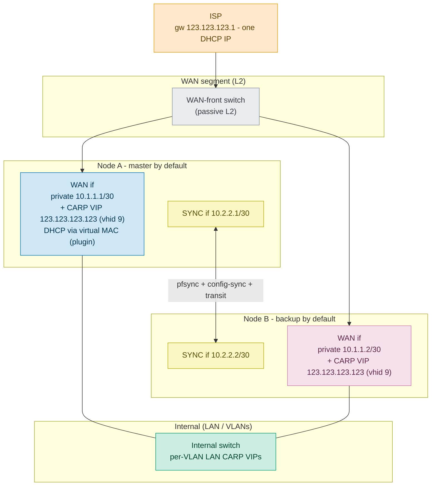
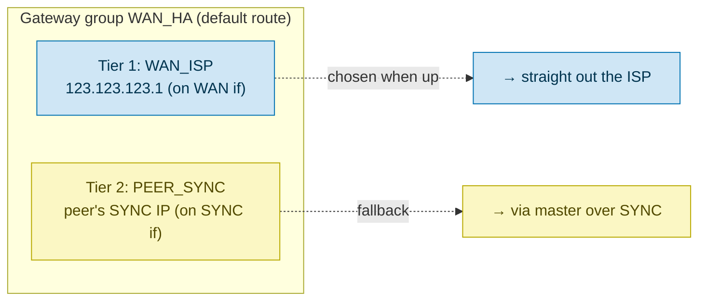
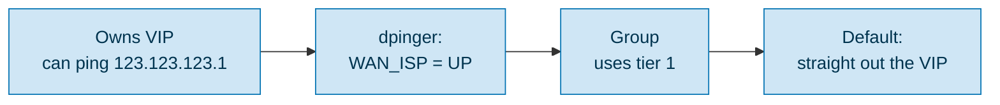
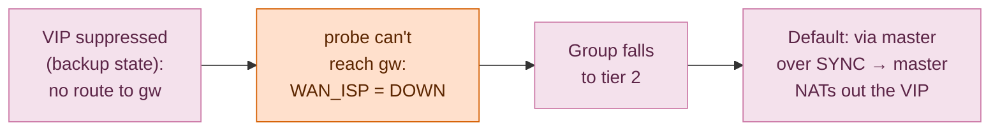
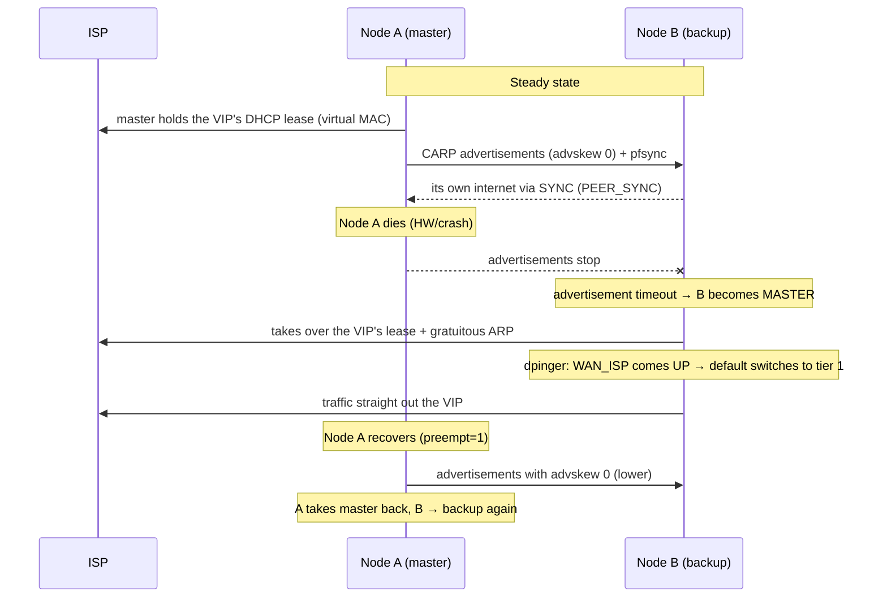

# CARP failover on a WAN with a single ISP-assigned IP

It uses the [os-carp-vip-dhcp](../README.md) plugin to keep the single public DHCP
lease alive on a virtual CARP MAC, so the address can float between two OPNsense
nodes: the classic "single-IP" obstacle to CARP on the WAN side.

> **Status: LAB-VALIDATED.** Every mechanism this design relies on is confirmed in an
> isolated two-node lab, with the DHCP-lease-on-a-virtual-MAC part also on a real CGNAT
> WAN. Not yet field-run on a live one-IP line, and the GUI gateway-group's automatic
> tier flip is inferred, not clicked through. §11 has the piece-by-piece status.

All addresses below are **examples, substitute your own.** The private ranges are
[RFC 1918](https://datatracker.ietf.org/doc/html/rfc1918); the public side uses an
arbitrary, good-looking address (`123.123.123.123`) purely for illustration.

> **In a hurry?** Jump to **§10 Implementation steps** for the click-by-click setup;
> the sections before it explain *why* it works.

---

## 1  Goal and problem

**Goal:** seamless firewall failover (hot-warm HA) without depending on the ISP
handing out more than one IP.

**The problem:** classic CARP on a WAN wants **three** IPs on the WAN segment:

| IP | Role |
|----|------|
| Node A's own | Source for CARP advertisements + node A's own WAN access |
| Node B's own | Same, for node B |
| Floating VIP | The address services answer on / NAT out of |

Most ISPs give you **one** DHCP address (here: gateway `123.123.123.1`, one leased
public IP). That leaves you two short. This document works around that.

> **A small *static* block (e.g. a `/30`) has the same shortage.** A `/30` gives two
> usable IPs - still one short of three. The topology below applies unchanged, with
> one simplification: a static public IP needs no lease-keeping, so you **skip the
> DHCP/plugin part** (§3 step 1 / §10 step 4) and simply assign the public address to
> the CARP VIP (or bind it as an IP-alias VIP to the CARP VIP). Everything else -
> private per-node WAN IPs for CARP, and the gateway group for the backup's internet
> (§6) - is identical. The plugin is only needed when that single public address is
> handed out by **DHCP**.

---

## 2  CARP mechanics (from `carp(4)`, FreeBSD + OpenBSD)

The facts that drive the design:

- **Failover needs only L2 adjacency.** The master is elected via advertisements -
  link-local IP multicast (`224.0.0.18`, proto 112) that never leaves the segment -
  carrying `vhid`, `advbase`, `advskew` and a crypto checksum over the VIP prefixes +
  `pass`. Nodes need no routing between them, just a shared segment and each other's
  presence.
- **`advskew` / `preempt`:** lowest `advskew` becomes master; `preempt=1` lets the
  intended master take the role back.
- **Auto-demotion:** FreeBSD raises the CARP **demotion counter** (added to `advskew`
  when computing the advertisement interval) when a vhid's interface goes down
  (`ifdown_demotion_factor=240`) or `pfsync` is mid-sync, so the master demotes itself and
  the backup takes over.
- **Virtual MAC** `00:00:5e:00:01:{vhid}`: the master answers ARP for the VIP with
  this address.
- **Backup state suppresses the VIP.** A vhid address in `BACKUP` state is not active
  on the interface, so the backup has no address in the VIP's subnet and **no
  connected route to the ISP gateway**. This, not source-address selection, is the
  real reason the backup's gateway monitor fails, which is what drives the gateway
  group (§6.2).
- **Important:** OpenBSD's warning that the carp device must share a subnet with
  the CARP VIP applies **only to `balancing` mode**. In ordinary master/backup,
  **a private node IP plus a public VIP in a different subnet works fine** -
  that is exactly what we exploit.

---

## 3  Core idea

1. **The CARP VIP owns the single public IP**, obtained over DHCP on the **virtual
   CARP MAC** (`00:00:5e:00:01:{vhid}`) via the
   [os-carp-vip-dhcp](../README.md) plugin. The lease follows the master on
   failover.
2. **Each node is assigned a small private static IP** on the WAN interface - set
   by hand, not via DHCP - used only for CARP advertisements + node identity. The ISP
   never *routes* it; the CARP advertisements are link-local multicast (`224.0.0.18`)
   that stays on the WAN segment. (The ISP's on-segment access gear does still see the
   frames and both nodes' physical MACs - see §8 for the strict one-MAC-per-port case.)
3. **The backup's own internet** is routed through the master over the SYNC link,
   driven by a **gateway group** whose gateway monitoring (dpinger) tracks the CARP
   role automatically (no `devd` hook needed).
4. **A WAN-front switch** (passive L2) gives both nodes access to the same WAN
   segment.

<details>
<summary><b>Direct VIP vs. IP-alias - why the public address sits straight on the CARP VIP</b></summary>

The leased public address *is* the CARP VIP's own address (the "direct" model). On a
follow the plugin rewrites the VIP and re-applies it **add-before-remove**, so the vhid
never loses its address on that node. Point outbound NAT and any address-dependent rule
at the plugin-managed **firewall Host alias** rather than a hardcoded IP - the plugin
updates the alias content live on a follow, so rules track the address without a ruleset
reload. *(A CARP advertisement's HMAC covers the VIP prefixes, so during a follow the two
nodes briefly advertise different prefixes; if they adopted the new address more than ~3 s
apart the backup could stop validating the master's adverts and promote - a transient
**dual-master** (lab-confirmed). The keeper closes this: it passively observes the peer's
DHCP ACK on the shared chaddr and follows within the same exchange, so both nodes converge
well under the ~3 s CARP timeout. Falls back to independent convergence if the peer's ACK
isn't visible.)*

An alternative binds the public address as an **IP-alias VIP on top of a CARP VIP that
carries a stable private *election* address** (same vhid, hence the same virtual MAC, so they
fail over together). It gives textbook same-subnet CARP, but adds a second VIP, needs
a ≥`/29` private WAN block, and changes **nothing** at L2 - inbound is answered with
the virtual MAC and egress uses the physical MAC either way (lab-verified). It is a
matter of taste, not a functional win, and the plugin's follow logic targets the
direct model - so **direct is the default**; reach for the alias form only if you
specifically want the election address in the node-IP subnet.

</details>

---

## 4  Topology



> Node A/B's private WAN IPs (`10.1.1.1/2`) are for CARP only. All real
> outbound traffic is NAT'd out of the VIP `123.123.123.123`.

---

## 5  IP plan (example addresses)

| Element | Value | Synced? | Note |
|---------|-------|---------|------|
| WAN public VIP | `123.123.123.123/24` (vhid 9) | Yes (VIP def) | Obtained via DHCP on virtual MAC `00:00:5e:00:01:09` |
| WAN gateway (ISP) | `123.123.123.1` | - | On-link via the VIP's /24 |
| Node A WAN private | `10.1.1.1/30` | No (per-node) | CARP advertisement source only |
| Node B WAN private | `10.1.1.2/30` | No (per-node) | - |
| SYNC subnet | `10.2.2.0/30` | - | pfsync + config-sync + transit |
| Node A SYNC | `10.2.2.1` | No (per-node) | - |
| Node B SYNC | `10.2.2.2` | No (per-node) | - |
| `advskew` A / B | `0` / `100` | No (per-node) | A is intended master, `preempt=1` |
| `pass` | shared secret | Yes | Authenticates advertisements on the shared segment |

> `vhid 9` gives virtual MAC `00:00:5e:00:01:09` (last MAC byte = vhid in hex). In
> production pick an unusual vhid - see [§8 vhid collision](#8-open-questions-and-risks)
> about shared ISP L2.

> **The VIP is not a network you choose:** it is whatever address the ISP leases on the
> virtual MAC, so it always sits in the ISP gateway's subnet. The `/24` here is
> illustrative; the real mask is the ISP's. With **Follow dynamic DHCP address** on, the plugin follows a
> changed lease, including a cross-subnet renumber: it adopts the new address and, from
> the DHCP ACK's subnet mask and gateway, updates the VIP prefix and the WAN gateway too,
> so outbound keeps working (the same as a plain DHCP interface). If the ACK carries no
> subnet mask it can only move the address, and logs a warning to fix the prefix and
> gateway by hand.

---

## 6  The backup's internet: the gateway group

The backup cannot reach `123.123.123.1` (it does not own the VIP), so it routes its
own traffic (pkg/NTP/DNS/dpinger) through the master over SYNC. **No hook** -
OPNsense's gateway monitoring (the *dpinger* daemon, configured as the gateway's
**Monitor IP** under _System ‣ Gateways_) drives the switch by reachability.

### 6.1  One gateway group, two gateways, two interfaces



- **1 × WAN**, **1 × SYNC** - the two gateways live on separate interfaces. Not two
  WAN lines.
- `PEER_SYNC` points at the peer's **fixed** SYNC IP (A: `10.2.2.2`,
  B: `10.2.2.1`) - per-node config, avoids a "the VIP is local to me" loop.

### 6.2  Automatic role tracking

**The node that is MASTER** (owns the VIP):



**The node that is BACKUP** (does not own the VIP):



> **The linchpin: lab-validated, mechanism corrected.** The master's monitor to
> `123.123.123.1` reports UP and the backup's reports DOWN, so the tiering engages with
> no hook. The reason is **not** dpinger's source address - it's that CARP **suppresses
> the VIP in backup state** (§2): the backup has no active address in the ISP's subnet
> and no connected route to the gateway, so its probe can't reach it, while the master
> (VIP active) can. More robust than a source-address argument, and the private
> `10.1.1.x` node IP is in a different subnet so it can never reach the gateway on-link
> either.

### 6.3  What the master needs to terminate the backup's traffic

| Element | Rule |
|---------|------|
| Outbound NAT | source `10.2.2.0/30`, translation = **WAN CARP VIP** (123.123.123.123), out the WAN |
| Firewall (SYNC) | allow `SYNC net -> any` (keep it tight: pkg/NTP/DNS/dpinger) |
| Return | arrives at the VIP (master), routed back to the backup's SYNC IP (`10.2.2.2`) on-link |

---

## 7  Failover flow



> **The failover speed is something _we_ set, not the ISP.** CARP declares a master
> dead after ~3 missed advertisements, so with `advbase 1` the switch is ~1–3 s
> (lower `advbase` = faster, at the cost of more advertisement chatter). The ISP
> only has to relearn the VIP's MAC on the new port (gratuitous ARP), which is
> near-instant. This covers the *failover* relearn: the virtual MAC is identical on
> both nodes, so the gateway's ARP entry stays valid and only the switch relearns the
> port. A separate, steady-state hazard - the gateway letting the VIP's ARP entry
> **expire** and never re-querying it - is independent of failover and is covered in
> §8.
>
> **Lab-validated.** A client's TCP connection carried data both **before and after** a
> mid-connection master failure (cable-pull): `pfsync` had synced the state (outbound
> NAT translating to the VIP keeps it portable across nodes) and the promoted node
> continued the same connection. On failover the switch relearns the virtual MAC from
> the new master's gratuitous ARP - no special switch config (§8 has the lab caveat on
> faithful failure injection).

---

## 8 Open questions and risks

- **`vhid` collision on a shared ISP L2:** if the ISP really shares L2 with other
  customers, `00:00:5e:00:01:{vhid}` could collide with another customer's
  VRRP/CARP. **Most fiber ISPs isolate customers per VLAN/port** (you only see gw
  `.1`), so safe. **Verify** with `tcpdump -T carp` + `arp -an` on the WAN before
  trusting it. Use an unusual `vhid` + a `pass` regardless.
- **The CARP `pass` secures the *election*, not the *segment*.** The `pass` (a SHA-1
  HMAC) stops a stranger from injecting CARP advertisements to hijack the VIP - but it
  does nothing about a hostile on-segment neighbour **ARP-spoofing** the VIP or the
  gateway directly - a **general untrusted-shared-L2 exposure** that a plain, non-CARP
  firewall on the same segment shares equally. CARP does not *create* that risk; it only
  *adds* the election as one more thing to authenticate. On a genuinely shared L2 you
  can additionally set CARP to **unicast** (`ifconfig <if> vhid <n> … peer <peer-node-IP>`;
  FreeBSD 14 `carp(4)`) so advertisements go only to the peer instead of flooding the
  segment - hardening the election against on-segment observation/injection. Caveats: it
  is a manual ifconfig-level setting (not exposed in the OPNsense VIP GUI, so not
  persistent without a hook), it disables CARP's TTL verification, and it still does
  **not** stop ARP-spoofing. So unicast hardens CARP; it does not make an untrusted shared
  L2 safe - and most fiber ISPs isolate per VLAN/port anyway (previous bullet), where it
  is moot.
- **`blockpriv`/`blockbogons` vs. CARP advertisements - should be fine:** a peer's
  advertisements arrive on the WAN with a **private/link-local source IP**
  (`10.1.1.x` hits `blockpriv`). OPNsense installs a global `quick` rule (roughly the
  form below) that lets CARP past all blocks:
  ```
  pass quick inet proto carp from any to 224.0.0.18
  ```
  `quick` is evaluated *before* `blockpriv`/`blockbogons`/default-deny, and it is
  interface-independent (`from any`), so it covers the WAN. Confirm with
  `pfctl -sr | grep carp` after the VIPs are set. (Observed on a working CGNAT
  two-node setup; **not** yet confirmed in this exact single-IP topology.)
- **Node IP:** the private node IP (`10.1.1.1/2`) is only the CARP advertisement
  source and never reaches the internet; the VIP does, via NAT. A `/30` RFC 1918
  link is the well-supported choice.
- **Gateway-monitor noise (dpinger):** the backup always logs `WAN_ISP` as DOWN -
  that *is* the mechanism, not a fault.
- **Failover transient:** connection states not covered by pfsync are lost across
  the switch.
- **Gateway that never re-ARPs the VIP (steady-state blackhole) - verify this:** some
  ISP gateways ignore gratuitous ARP *and* never re-query an ARP entry once it
  expires. A few minutes after the last refresh, return traffic to the VIP then
  blackholes silently even with a stable master - outbound leaves, nothing comes
  back, and the gateway stops answering pings sourced from the VIP. This is not
  hypothetical; it bit a real deployment on this kind of fiber ISP. **Mitigation:**
  the plugin's **ARP nudge** (on by default) periodically re-teaches the gateway the
  VIP-to-virtual-MAC binding, keeping the entry fresh. Leave it enabled for this
  topology; see the *ARP nudge* section in the [README](../README.md). Symptom to
  recognize in the lab: everything works right after a CARP event or DHCP exchange,
  then dies ~15–20 min later.
- **DHCP behaviour (test before committing):** does the ISP hand a lease to the
  virtual MAC, and does it restrict you to one active MAC? Some ISPs will happily
  lease a second address to a second MAC (in which case you do **not** need this
  single-IP design at all - just give each node its own lease). Others bind one lease
  per line. **Test safely** with a DHCP `DISCOVER`-only probe before committing - a
  `DISCOVER` does not take a lease, so it does not disturb the live line. (Verified on
  a fiber ISP: a small Scapy `DISCOVER` from a throwaway MAC drew a normal `OFFER`
  with no effect on the live lease. Use a **throwaway** locally-administered MAC, not
  the real virtual MAC, so a lease-binding ISP cannot associate the probe with your
  VIP.)
- **Follow moves the VIP address only - not the prefix or the gateway:** on an ISP
  renumber the keeper rewrites the CARP VIP to the new address (after checking it is
  sane, in the same routability class, and from the expected server), but it does
  **not** touch the interface prefix or System ‣ Gateways. A **same-subnet** change is
  seamless. A **cross-subnet** move leaves the default route pointing at the old
  gateway, so outbound dies despite a "successful" follow. The keeper now logs a loud
  error when the ACK's gateway (DHCP option 3) changes: read it as "update the prefix
  and gateway by hand." If your ISP renumbers across subnets, plan for manual steps.
- **Follow trusts the DHCP ACK, which a shared-L2 neighbour can forge:** on a genuinely
  shared segment an attacker who reads the CARP adverts (to derive the virtual MAC) can
  send a spoofed ACK and drive the VIP to an address of their choosing (throttled to one
  move per 60 s). During a T2 **REBIND** the expected-server check is intentionally
  relaxed (any server may answer - legitimate DHCP), widening the window. This is the
  same untrusted-shared-L2 exposure as the ARP-spoofing bullet above, and moot where the
  ISP isolates you per VLAN/port. On a shared L2, pin the address (follow off) or use a
  strict upstream.
- **Stopping the service is not the same as disabling a keeper:** disabling/removing a
  keeper and pressing Apply drops it from `keeper.conf`, so the CARP eligibility hook
  ignores it - no demotion. Stopping the whole *service*, by contrast, freezes the
  heartbeats; a `demote_on_lease_loss` keeper then reads as failed and the node demotes,
  handing the VIP to the peer. To take a node out of rotation on purpose that may be
  what you want; to pause a keeper **without** a failover, disable the keeper - don't
  stop the service.
- **SYNC-link failure while both WAN ports stay up:** CARP advertisements still cross the
  WAN segment, so **the master keeps its role - no spurious failover or ping-pong**
  (lab-confirmed: `pfsync` demotion penalizes only the *out-of-sync* node - a backup
  rejoining over the dead link went demotion 240 to 480 and stayed backup; the master was
  untouched). What you lose is state replication (a *later* failover then drops the
  unsynced connections) and, in this design, the backup's own internet (which rides the
  SYNC path, §6 - a convenience, see §9). Keep SYNC on a reliable dedicated link anyway.
- **Short gateway ARP timeout:** the 120 s ARP-nudge default suits most gateways,
  including shorter-lived caches. A few CPE/BNG age ARP even faster - if the VIP
  blackholes between nudges, lower the interval further (toward the 30 s floor) below
  the gateway's ARP timeout.
- **Identical DHCP client-id across nodes:** the shared-lease premise assumes the server
  keys on `chaddr`. If it keys on the client-id (option 61) and the two nodes present
  different ones, they can get *different* addresses - set the same client-id on both
  (config-sync makes this automatic).
- **IPv6 does not fail over:** this is an IPv4-DHCP design. A DHCPv6-PD prefix will not
  float with the VIP, so after an IPv4 failover expect broken/asymmetric IPv6 on the
  surviving node until it re-acquires. Plan v6 HA separately.
- **Lab failure modes to watch:** return-path routing for the backup's SYNC-sourced
  traffic, dpinger flapping during role changes, and whether the ISP's DHCP server
  tolerates the virtual MAC.
- **Faithful failure injection (virtual labs):** to test failover, drop the **link** -
  pull the cable, down the host-side tap, or stop the VM. Running `ifconfig down`
  *inside* the guest is **not** equivalent: on a virtual switch the host tap stays up,
  so the bridge never flushes its MAC table and traffic to the virtual MAC keeps going
  to the dead node's port. That is a test artifact, not a design flaw - a real link/
  node failure drops the port and the switch relearns immediately. Likewise, do not
  pin the virtual MAC with a static FDB entry while testing; let the switch learn it.

---

## 9  Reality check

Both nodes share **one** physical WAN uplink, so backup WAN-gateway monitoring adds
no real HA value (if the WAN is down, it is down for both). The backup's internet
(§6) is a **convenience** (self-`pkg`/NTP), not an HA requirement - the backup can
skip it entirely and pull NTP/DNS/config from the master over SYNC, dropping §6.

---

## 10  Implementation steps (OPNsense GUI)

*Addresses in this section (`10.1.1.x` node WAN, `10.2.2.x` SYNC, `123.123.123.x` public)
are examples, substitute your own.*

> **Pre-flight: confirm the ISP serves the virtual MAC (do this *first*).** The whole
> design hinges on the ISP leasing the public address to the CARP virtual MAC
> (`00:00:5e:00:01:{vhid}`), not only to your interface's burned-in MAC. Some ISPs bind
> the single lease to the first MAC they see and will **NAK a `REQUEST` from any other
> MAC and stay silent to its `DISCOVER`**, in which case this design cannot work as-is
> and you need a fixed-MAC-plus-CARP-gated approach instead. Verify with
> `tcpdump -ni <wan> udp port 67 or udp port 68` while a `DISCOVER` goes out on the
> virtual chaddr: an `OFFER`/`ACK` addressed to the virtual MAC means you are good; a
> NAK-then-silence means the line is MAC-bound. Note OPNsense's `dhclient` (OpenBSD
> variant) has **no `-r`/release** flag, so to free the current lease for a clean test
> you send a `DHCPRELEASE` another way (e.g. a small Scapy script). See §8 *DHCP
> behaviour* and §11.

Work through these on **node A** first; confirm it holds the lease and reaches the
internet, then repeat the per-node parts on **node B**. Config-synced items (aliases,
the keeper) only need doing once.

### 10.1  Define aliases first, they make every later rule simpler

Set these up under _Firewall ‣ Aliases_ before writing any rule. Referring to names
instead of raw addresses keeps the ruleset readable, and for the VIP it lets the public
address change without touching a single rule.

| Alias | Type | Content | Used by |
|-------|------|---------|---------|
| `wan_carp_vip` | Host | *(plugin-managed, the live public VIP)* | Outbound-NAT target; any rule that must follow the WAN address |
| `wan_carp_nodes` | Network | the per-node private WAN range (`10.1.1.0/30`) | The no-NAT CARP rule; SYNC/return rules |
| `internal_nets` | Network | your LAN/VLAN subnets (or the built-in `RFC1918`) | The single "internal to VIP" outbound-NAT rule |

> **`wan_carp_vip` is created and owned by the plugin:** give the keeper a **Sync firewall alias** name
> and it ensures a Host alias of that name exists and keeps its content equal to the live
> VIP, updated on every lease change. Point outbound NAT (and anything address-dependent)
> at it and those rules follow the address **with no ruleset reload**. **Do not hand-edit
> it.** Editing the alias out-of-band does not reach the live pf table until a full
> `filter reload` (a plain `refresh_aliases` leaves the table stale), and the plugin
> reconciles it back anyway. Let the plugin drive it. (Likewise, disabling the keeper's
> *service* does not release the alias; the reconcile keys on the keeper's **Enabled**
> box, so un-tick **Enabled** to hand the alias back.)

### 10.2  Steps

1. **WAN-front switch** physically between the ISP hand-off and both nodes' WAN ports.
2. **WAN interface per node:** static private IP (`10.1.1.1/30` on A, `.2/30` on B).
   The ISP gateway (`123.123.123.1`) is **not** in this `/30`, so when you create the
   gateway (step 6) mark it **Far Gateway**, otherwise OPNsense rejects the off-subnet
   gateway. On-link reachability to `.1` comes from the VIP's public `/24` on the same
   interface.
3. **CARP VIP** `123.123.123.123/24`, vhid 9, `pass`, advskew 0/100, under
   _Interfaces ‣ Virtual IPs_.
4. **Plugin** [os-carp-vip-dhcp](../README.md): a keeper on the VIP with **Follow dynamic
   DHCP address** on, and set its **Sync firewall alias** to `wan_carp_vip` (§10.1). Both
   nodes hold the lease warm, so failover is seamless, but on a shared WAN-front switch
   both nodes periodically source the virtual MAC (DHCP renewals), which can cause a
   MAC-table flap; use a switch/topology that tolerates it (or a dedicated point-to-point
   uplink). (The ARP nudge is master-gated, so it never adds to the flap; only the DHCP
   renewals do.)
5. **SYNC interface:** `10.2.2.1/30` / `.2/30`; pfsync + XMLRPC config-sync, under
   _System ‣ High Availability_.
6. **Gateways:** `WAN_ISP` (`123.123.123.1`, on WAN, **Far Gateway**, see step 2),
   `PEER_SYNC` (peer's SYNC IP, on SYNC), under _System ‣ Gateways_.
7. **Gateway group** `WAN_HA` = `[WAN_ISP tier 1, PEER_SYNC tier 2]`; point the default
   route / floating policy at the group.
8. **Outbound NAT** (_Firewall ‣ NAT ‣ Outbound_, mode **Hybrid**). Order matters: put
   the no-NAT rule **above** the catch-all:
   1. **no-NAT for CARP**: source `wan_carp_nodes`, destination `224.0.0.18`,
      **Do not NAT**, placed **first**. The node-private IPs are RFC 1918, so the
      catch-all below would otherwise rewrite the source of your CARP advertisements
      (multicast `224.0.0.18`) and break the election.
   2. **internal to VIP**: source `internal_nets` (or `RFC1918`), destination any,
      translation **`wan_carp_vip`**. One rule replaces per-subnet rules, and pointing
      at the alias makes it follow the lease.
   3. **backup transit** (§6.3): source `wan_carp_nodes` (or the SYNC net) to any,
      translation `wan_carp_vip`, so the backup's own traffic NATs out the VIP on the
      master.
   > **Why the alias, not "Interface address":** the WAN interface's *primary* address is
   > the private node IP, so translating to "Interface address" would NAT to `10.1.1.x`,
   > unroutable. `wan_carp_vip` is the public address. (Cosmetic GUI quirk: a Do-not-NAT
   > rule still shows "Interface address" in the *Translate* column; that field is
   > ignored when Do-not-NAT is ticked; it renders as `no nat` in pf.)
9. **Firewall (SYNC):** allow `SYNC net -> any`, kept tight (pkg/NTP/DNS/dpinger).
10. **Verify:**
    - `pfctl -sn | grep -E 'no nat|wan_carp'`: the `no nat … to 224.0.0.18` rule sits
      **above** the catch-all `-> <wan_carp_vip>` rule.
    - `pfctl -t wan_carp_vip -T show`: the alias table holds the live *public* address
      (not a stale or private one).
    - `tcpdump -T carp` on the WAN (advertisements), a failover test (down the master
      NIC), dpinger switching tier, and the VIP lease following the master.

---

## 11 What is validated vs. still open

Two environments were used: an isolated two-node **Proxmox lab** for the failover
machinery, and a **real CGNAT WAN** for the DHCP part.

| Piece | Status |
|-------|--------|
| Keeping a DHCP lease alive on a CARP virtual MAC (this plugin) | **Confirmed on a real CGNAT WAN** - two-node setup |
| A DHCP-assigned VIP address following the master (lease on a fresh virtual MAC, VIP routable) | **Confirmed on a real CGNAT WAN** |
| A `DISCOVER`-only probe leaves the live lease untouched | **Confirmed on a real fiber ISP** - throwaway-MAC `DISCOVER` drew an `OFFER`, no lease change |
| ARP nudge keeps a non-re-ARPing gateway from blackholing the VIP | **Confirmed on a real fiber ISP** - it was required there; on by default (see README) |
| Private per-node WAN IP (different subnet) as CARP-advertisement source only | **Lab-validated** - CARP elected master/backup correctly with private `/30` node IPs and a public VIP in a different subnet |
| Backup's gateway monitor = DOWN, master's = UP (the §6 linchpin) | **Lab-validated** - mechanism is CARP backup-state VIP suppression, **not** dpinger's source address (§6.2) |
| A client's TCP connection survives a master failover (`pfsync` + NAT to VIP) | **Lab-validated** - bytes flowed on the same connection before *and* after a mid-connection cable-pull of the master |
| The switch relearns the VIP's MAC on failover | **Lab-validated** - the bridge relearns from the new master's gratuitous ARP; no special switch config, extra bridge, or NIC driver needed |
| Gateway group routing the backup's own internet through the master | **Lab-validated (path); tier-flip inferred** - the backup reached an upstream target through the master over SYNC, NAT'd out the VIP (target saw the VIP as source; the extra-hop TTL confirmed the path). The GUI gateway-group's *automatic* tier flip on role change composes this with the confirmed monitor DOWN/UP above (a stock OPNsense feature) but was not separately clicked through |
| The full single-IP topology as one integrated system, on a live one-IP line | **Still open** - every mechanism above is validated individually, but they have not been run stitched together on a real single-IP WAN over time |

If you run the full topology - especially the backup's own-internet path - please open
an issue with what worked and what did not.
