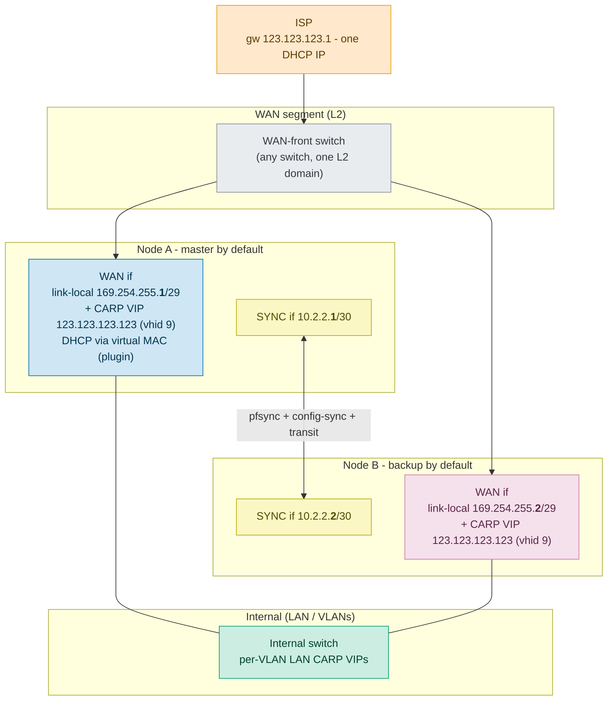
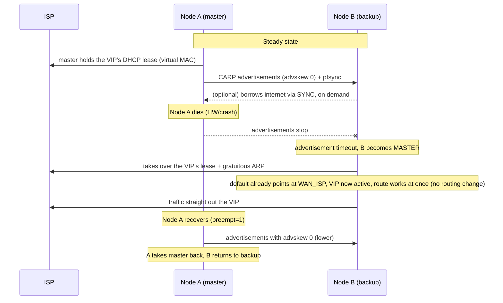
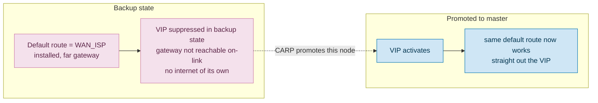

# CARP failover on a WAN with a single ISP-assigned IP

It uses the [os-carp-vip-dhcp](../README.md) plugin to keep the single public DHCP
lease alive on a [virtual CARP MAC](#t-vmac), so the address can float between two OPNsense
nodes: the classic "single-IP" obstacle to CARP on the WAN side.

> **Status: FIELD-VALIDATED.** The integrated topology has now run on a live single-IP
> DHCP WAN, including a real CARP failover, on top of the earlier isolated two-node lab
> (failover machinery) and a real CGNAT WAN (the DHCP-lease-on-a-virtual-MAC part). One
> correction came out of that run: giving the backup its own internet via an **automatic
> gateway-group tier flip is failover-unsafe**, and is replaced by a fixed default route
> plus an optional on-demand path ([section 8](#s8)). [section 9](#s9) has the piece-by-piece status.

All addresses below are **examples, substitute your own.** The per-node WAN IPs are
**link-local** (`169.254.0.0/16`); the other private ranges (SYNC, internal) are
[RFC 1918](https://datatracker.ietf.org/doc/html/rfc1918); the public side uses an
arbitrary, good-looking address (`123.123.123.123`) purely for illustration.

> **In a hurry?** Jump to **[Implementation steps](#s6)**
> for the click-by-click setup; the sections before it explain *why* it works.

---

## Terms

| Term | Meaning |
|------|---------|
| <a id="t-carp"></a>**CARP** | Common Address Redundancy Protocol - floats a virtual IP between two nodes on a shared segment ([`carp(4)`](https://man.freebsd.org/cgi/man.cgi?query=carp&sektion=4)) |
| <a id="t-vip"></a>**VIP** | Virtual IP - the floating address a CARP group owns and answers on |
| <a id="t-vhid"></a>**vhid** | Virtual Host ID - identifies a CARP group on the segment and sets its virtual MAC `00:00:5e:00:01:{vhid}` |
| <a id="t-vmac"></a>**virtual MAC** | The CARP-derived MAC `00:00:5e:00:01:{vhid}` the master answers the VIP's ARP with; identical on both nodes, so the address floats on failover without the gateway relearning it |
| <a id="t-advbase"></a>**advbase** | CARP advertisement base interval - the seconds between a node's CARP advertisements |
| <a id="t-advskew"></a>**advskew** | Skew added to `advbase` to set a node's CARP advertisement interval; the lowest wins the election (preferred master) |
| <a id="t-pass"></a>**`pass`** | The CARP passphrase that authenticates advertisements. `carp(4)`/ifconfig call it `pass`; the OPNsense GUI labels the same field "Password" |
| <a id="t-preempt"></a>**preempt** | The FreeBSD CARP sysctl `net.inet.carp.preempt` (`1` = on, the OPNsense default) - not a per-VIP GUI field - that lets a recovered node with the lower `advskew` take the master role back |
| <a id="t-demotion"></a>**demotion counter** | FreeBSD CARP counter (`net.inet.carp.demotion`) added to `advskew`; raised when an interface goes down (by `net.inet.carp.ifdown_demotion_factor`, default 240) or `pfsync` is mid-sync, to hand the role to the peer |
| <a id="t-pfsync"></a>**pfsync** | Kernel protocol that replicates firewall connection state between the two nodes |
| <a id="t-dpinger"></a>**dpinger** | OPNsense's gateway-monitoring daemon |
| <a id="t-sync"></a>**SYNC** | The dedicated inter-node link carrying `pfsync` + config-sync |
| <a id="t-linklocal"></a>**link-local** | `169.254.0.0/16` addresses ([RFC 3927](https://datatracker.ietf.org/doc/html/rfc3927)) - valid only on the local segment, never routed (see [IP and CARP plan](#s6-1)) |
| <a id="t-l2"></a>**L2 (Layer 2)** | The switched Ethernet segment (data-link layer, one broadcast domain) the two nodes share; CARP elects and fails over within it, with no router in between |

---

## 1 Goal and problem

**Goal:** seamless firewall failover (hot-warm HA) without depending on the ISP
handing out more than one IP.

**The problem:** classic CARP on a WAN wants **three** IPs on the WAN segment:

| IP | Role |
|----|------|
| Node A's own | Source for CARP advertisements + node A's own WAN access |
| Node B's own | Same, for node B |
| Floating [VIP](#t-vip) | The address services answer on / NAT out of |

Most ISPs give you **one** DHCP address (here: gateway `123.123.123.1`, one leased
public IP). That leaves you two short. This document works around that.

> **A small *static* block (e.g. a `/30`) has the same shortage.** A `/30` gives two
> usable IPs - still one short of three. The topology below applies unchanged, with
> one simplification: a static public IP needs no lease-keeping, so you **skip the
> DHCP/plugin part** ([section 3](#s3) step 2 / [section 6.3](#s6-3) step 4) and simply assign the public address to
> the CARP VIP (or bind it as an IP-alias VIP to the CARP VIP). Everything else -
> the per-node WAN IPs for CARP, and the backup's own-internet handling ([section 8](#s8)) - is
> identical. The plugin is only needed when that single public address is
> handed out by **DHCP**.

---

<a id="s2"></a>

## 2 CARP mechanics (from [`carp(4)`](https://man.freebsd.org/cgi/man.cgi?query=carp&sektion=4), FreeBSD + OpenBSD)

The facts that drive the design:

- **Failover needs only a shared [Layer 2 (L2)](#t-l2) segment.** The master is elected via advertisements -
  link-local IP multicast (`224.0.0.18`, proto 112) that never leaves the segment -
  carrying `vhid`, `advbase`, `advskew` and a crypto checksum over the VIP prefixes +
  `pass`. Nodes need no routing between them, just a shared segment and each other's
  presence.
- **`advskew` / `preempt`:** lowest `advskew` becomes master; `preempt=1` lets the
  intended master take the role back.
- **Auto-demotion:** FreeBSD raises the CARP **demotion counter** (added to `advskew`
  when computing the advertisement interval) when a vhid's interface goes down
  (`net.inet.carp.ifdown_demotion_factor=240`) or `pfsync` is mid-sync, so the master demotes itself and
  the backup takes over.
- **Virtual MAC** `00:00:5e:00:01:{vhid}`: the master answers ARP for the VIP with
  this address.
- **Backup state suppresses the VIP.** A vhid address in `BACKUP` state is not active
  on the interface, so the backup has no address in the VIP's subnet and **no
  connected route to the ISP gateway**. This, not source-address selection, is the
  real reason the backup's gateway monitor fails and why the backup has no internet of
  its own ([section 8](#s8)). It is *not* a safe trigger for automatic gateway switching ([section 8.1](#s8-1)).
- **Important:** OpenBSD's warning that the carp device must share a subnet with
  the CARP VIP applies **only to `balancing` mode**. In ordinary master/backup,
  **a non-routable node IP (link-local or RFC 1918) plus a public VIP in a different subnet works fine** -
  that is exactly what we exploit.

---

<a id="s3"></a>

## 3 Core idea

1. **A WAN-front switch** gives both nodes access to the same WAN segment - the physical
   prerequisite everything else builds on. Any ordinary switch works - it just has to keep
   both nodes and the ISP hand-off in one L2 broadcast domain; managed or unmanaged,
   L2-only or L3-capable (as long as you don't route this segment).
2. **The CARP VIP owns the single public IP**, obtained over DHCP on the **virtual
   CARP MAC** (`00:00:5e:00:01:{vhid}`) via the
   [os-carp-vip-dhcp](../README.md) plugin. The lease follows the master on
   failover.
3. **Each node is assigned a small link-local static IP** (`169.254.x`) on the WAN
   interface - set by hand, not via DHCP - used only for CARP advertisements + node
   identity. The ISP
   never *routes* it; the CARP advertisements are link-local multicast (`224.0.0.18`)
   that stays on the WAN segment. (The ISP's on-segment access gear does still see the
   *master's* physical MAC as source - CARP advertisements and egress both use it - plus
   the virtual MAC; the backup stays silent on the WAN until it takes over, when that
   physical MAC flips to it. See [section 7](#s7) for the strict one-MAC-per-port case.)
   Because that range is not RFC 1918, the outbound `internal to VIP` SNAT catch-all never
   matches the node IP as a *source*, so it needs no no-NAT-for-CARP carve-out - one rule
   fewer ([IP and CARP plan](#s6-1)). (Egress still leaves via the VIP: that SNAT's *target* is set
   explicitly to the VIP, not the interface's link-local primary - which is unroutable -
   see [section 6.3](#s6-3) step 8.)
4. **The default route stays pinned to the ISP gateway** (via the VIP) on both nodes,
   so a promoted backup routes out the instant it owns the VIP - failover needs no
   routing change. In backup state a node has no internet of its own; if it must
   self-update, it borrows the master's path over [SYNC](#t-sync) **on demand** ([section 8](#s8)), never via
   automatic gateway switching (failover-unsafe, [section 8.1](#s8-1)).

<details>
<summary><b>Direct VIP vs. IP-alias - why the public address sits straight on the CARP VIP</b></summary>

The leased public address *is* the CARP VIP's own address (the "direct" model). On a
follow the plugin rewrites the VIP and re-applies it **add-before-remove**, so the vhid
never loses its address on that node. Point Source NAT and any address-dependent rule
at the plugin-managed **firewall Host alias** rather than a hardcoded IP - the plugin
updates the alias content live on a follow, so rules track the address without a ruleset
reload. *(A CARP advertisement's HMAC covers the VIP prefixes, so during a follow the two
nodes briefly advertise different prefixes; if they adopted the new address more than ~3 s
apart the backup could stop validating the master's adverts and promote - a transient
**dual-master** (lab-confirmed). The keeper closes this: it passively observes the peer's
DHCP ACK on the shared chaddr and follows within the same exchange, so both nodes converge
well under the ~3 s CARP timeout. Falls back to independent convergence if the peer's ACK
isn't visible.)*

An alternative binds the public address as an **IP-alias VIP on top of a CARP VIP that
carries a stable private *election* address** (same vhid, hence the same virtual MAC, so they
fail over together). It gives textbook same-subnet CARP, but adds a second VIP, needs
a ≥`/29` private WAN block, and changes **nothing** at L2 - inbound is answered with
the virtual MAC and egress uses the physical MAC either way (lab-verified). It is a
matter of taste, not a functional win, and the plugin's follow logic targets the
direct model - so **direct is the default**; reach for the alias form only if you
specifically want the election address in the node-IP subnet.

</details>

---

## 4 Topology



> Node A/B's link-local WAN IPs (`169.254.255.1/2`) are for CARP only. All real
> outbound traffic is NAT'd out of the VIP `123.123.123.123`.

---

## 5 Failover flow



> **The failover speed is something _we_ set, not the ISP.** CARP declares a master
> dead after ~3 missed advertisements, so with `advbase 1` the switch is ~1–3 s
> (lower `advbase` = faster, at the cost of more advertisement chatter). The ISP
> only has to relearn the VIP's MAC on the new port (gratuitous ARP), which is
> near-instant. This covers the *failover* relearn: the virtual MAC is identical on
> both nodes, so the gateway's ARP entry stays valid and only the switch relearns the
> port. A separate, steady-state hazard - the gateway letting the VIP's ARP entry
> **expire** and never re-querying it - is independent of failover and is covered in
> [section 7](#s7).
>
> **Lab-validated, and exercised on real ISPs.** The failover itself has run on real
> WANs: the VIP followed the master on a CGNAT WAN, and on a live single-IP WAN a real
> CARP failover promoted the backup, which served immediately ([section 9](#s9)). The
> connection-level details here are the lab findings - a client's TCP connection carried
> data both **before and after** a mid-connection cable-pull (`pfsync` had synced the
> state; outbound NAT to the VIP keeps it portable across nodes, so the promoted node
> continued the same connection), and the switch relearns the virtual MAC from the new
> master's gratuitous ARP with no special switch config ([section 7](#s7) has the lab caveat
> on faithful failure injection).

---

<a id="s6"></a>

## 6 Implementation steps (OPNsense GUI)

*Addresses in this section (`169.254.255.x` node WAN, `10.2.2.x` SYNC, `123.123.123.x` public)
are examples, substitute your own.*

> **NAT menu:** the Firewall ‣ NAT menu carries both a **Source NAT** page and a legacy
> **Outbound** page (both are present on 26.1 and 26.7). Either can host the source-NAT rule
> this guide needs; the steps below use **Source NAT** (_Firewall ‣ NAT ‣ Source NAT_). See
> also OPNsense's CARP how-to,
> [Setup outbound NAT](https://docs.opnsense.org/manual/how-tos/carp.html#setup-outbound-nat).

> **Pre-flight: confirm the ISP serves the virtual MAC (do this *first*).** The whole
> design hinges on the ISP leasing the public address to the CARP virtual MAC
> (`00:00:5e:00:01:{vhid}`), not only to your interface's burned-in MAC. Some ISPs bind
> the single lease to the first MAC they see and **NAK a `REQUEST` from any other MAC and
> stay silent to its `DISCOVER`** - then this design cannot work as-is and you need a
> fixed-MAC-plus-CARP-gated approach instead. Check it while the WAN is still on DHCP; it
> needs no static cutover, so the reboot in [section 7](#s7) *First cutover* (a
> DHCP-to-static issue) does not apply here. Two ways:
>
> - **Simplest (all GUI):** temporarily set the WAN interface's **MAC address** to the
>   virtual MAC under _Interfaces ‣ [WAN]_, Apply, and see whether it pulls the public
>   lease. The interface stays DHCP (no reboot trap), and this runs the full exchange on
>   the virtual MAC - conclusive, but it *takes* a lease, so on a MAC-binding line expect
>   a brief WAN blip and a possible cooldown ([section 7](#s7) *First cutover*) on revert
>   (clear the MAC field + Apply).
> - **Non-disturbing:** send a `DISCOVER`-only probe on the virtual chaddr (a small Scapy
>   script) and watch the reply in _Interfaces ‣ Diagnostics ‣ Packet Capture_ (or
>   `tcpdump -ni <wan> udp port 67 or udp port 68`): `OFFER`/`ACK` to the virtual MAC = good,
>   NAK-then-silence = MAC-bound. A `DISCOVER` takes no lease, so it leaves the live line
>   untouched. (OPNsense's `dhclient` has **no `-r`/release** flag; for a maximally clean
>   test free the current lease with a `DHCPRELEASE` sent another way.) See [section 7](#s7)
>   *DHCP behaviour* and [section 9](#s9).

<a id="s6-1"></a>

### 6.1 IP and CARP plan (example values)

| Element | Value | Synced? | Note |
|---------|-------|---------|------|
| WAN public VIP | `123.123.123.123/24` (vhid 9) | Yes (VIP def) | Obtained via DHCP on virtual MAC `00:00:5e:00:01:09` |
| WAN gateway (ISP) | `123.123.123.1` | - | On-link via the VIP's /24 |
| Node A WAN (link-local) | `169.254.255.1/29` | No (per-node) | CARP advertisement source only; never egresses |
| Node B WAN (link-local) | `169.254.255.2/29` | No (per-node) | - |
| SYNC subnet | `10.2.2.0/30` | - | pfsync + config-sync + transit |
| Node A SYNC | `10.2.2.1` | No (per-node) | - |
| Node B SYNC | `10.2.2.2` | No (per-node) | - |
| `advskew` A / B | `0` / `100` | No (per-node) | A is intended master, `preempt=1` |
| `pass` | shared secret | Yes | Authenticates advertisements on the shared segment |

> `vhid 9` gives virtual MAC `00:00:5e:00:01:09` (last MAC byte = vhid in hex). In
> production pick an unusual vhid - see [vhid collision](#s7)
> about shared ISP L2.

> **The VIP is not a network you choose:** it is whatever address the ISP leases on the
> virtual MAC, so it always sits in the ISP gateway's subnet. The `/24` here is
> illustrative; the real mask is the ISP's. With **Follow dynamic DHCP address** on, the plugin follows a
> changed lease, including a cross-subnet renumber: it adopts the new address and, from
> the DHCP ACK's subnet mask and gateway, updates the VIP prefix and the WAN gateway too,
> so outbound keeps working (the same as a plain DHCP interface). If the ACK carries no
> subnet mask it can only move the address, and logs a warning to fix the prefix and
> gateway by hand.

> **Why link-local for the node IPs.** Link-local (`169.254.0.0/16`,
> [RFC 3927](https://datatracker.ietf.org/doc/html/rfc3927)) is valid only on the local
> wire and is never routed off it - ideal for node IPs that only carry CARP on the WAN
> segment. Assign any address in that range statically; a block inside `169.254.255.0/24`
> stays clear of `169.254.1.0`-`169.254.254.255` (the range OS auto-configuration draws
> from), so nothing ever auto-assigns into yours - and avoid the block's network and
> broadcast (`.0`/`.7` in a `/29`). Because these IPs only source CARP advertisements and
> never egress, keeping them link-local means the outbound catch-all NAT
> ([section 6.3](#s6-3) step 8) never matches them, so this setup needs **no
> no-NAT-for-CARP rule** and no extra alias. Verified on OPNsense 26.7: **Block bogon
> networks** (`blockbogons`) does **not** block `169.254.0.0/16` (negated in the bogons
> table), and **Block private networks** (`blockpriv`) was off on this interface, so the
> GUI accepts a static link-local WAN
> IP and CARP elects and fails over normally. (Caveat: since the catch-all matches RFC
> 1918 and not link-local, traffic the backup *sources from its own link-local WAN IP*
> is not NAT'd - in practice only the WAN gateway probe, which is meant to fail on the
> backup anyway.)
>
> **Alternative - RFC 1918 node IPs** (e.g. `10.1.1.0/30`) work too, at the cost of extra
> configuration: being RFC 1918 they are caught by the outbound catch-all, which would
> rewrite the *source* of your CARP advertisements and break the election. You then need a
> `wan_carp_nodes` alias and a no-NAT-for-CARP rule ([section 6.3](#s6-3) step 8). Link-local avoids both.

<a id="s6-2"></a>

### 6.2 Define aliases first, they make every later rule simpler

Set these up under _Firewall ‣ Aliases_ before writing any rule. Referring to names
instead of raw addresses keeps the ruleset readable, and for the VIP it lets the public
address change without touching a single rule.

| Alias | Type | Content | Used by |
|-------|------|---------|---------|
| `wan_carp_vip` | Host | *(plugin-managed, the live public VIP)* | Source-NAT target; any rule that must follow the WAN address |
| `internal_nets` | Network | your LAN/VLAN subnets (or the RFC 1918 ranges) | The single "internal to VIP" source-NAT rule |

> **`wan_carp_vip` is created and owned by the plugin:** give the keeper a **Sync firewall alias** name
> and it ensures a Host alias of that name exists and keeps its content equal to the live
> VIP, updated on every lease change. **You may pre-create the Host alias yourself** (handy if
> you want to reference it in rules before the keeper runs): on start the plugin **adopts** a
> matching pre-existing alias - it must be type **Host** - stamps its marker, and drives the
> content from then on. Point Source NAT (and anything address-dependent)
> at it and those rules follow the address **with no ruleset reload**. **Do not hand-edit
> it.** Editing the alias out-of-band does not reach the live pf table until a full
> `filter reload` (a plain `refresh_aliases` leaves the table stale), and the plugin
> reconciles it back anyway. Let the plugin drive it. (Likewise, disabling the keeper's
> *service* does not release the alias; the reconcile keys on the keeper's **Enabled**
> box, so un-tick **Enabled** to hand the alias back.)

<a id="s6-3"></a>

### 6.3 Steps

Work through these on **node A** first; confirm it holds the lease and reaches the
internet, then repeat the per-node parts on **node B**. Config-synced items (aliases,
the keeper) only need doing once.

> **You can stop after node A and add HA later.** One node is already a complete single-IP
> firewall: the CARP VIP simply stays master, the plugin keeps the lease, and NAT works.
> Steps 1-4 and 6-8 stand alone; the SYNC bits (**steps 5 and 9**, plus config-sync) and
> node B's per-node setup come in only when you add the peer. Standing node A up alone
> first lets you validate the DHCP-on-a-virtual-MAC part before layering on HA.

1. **WAN-front switch** physically between the ISP hand-off and both nodes' WAN ports.
2. **WAN interface per node:** static **link-local** IP (`169.254.255.1/29` on A,
   `.2/29` on B; an RFC 1918 range works too but needs the no-NAT-for-CARP rule, [section 6.1](#s6-1)).
   Because this interface is **static** (the public address lives on the VIP, not here),
   OPNsense does **not** auto-create a gateway the way it does for a DHCP WAN - you add
   `WAN_ISP` by hand in step 6. The ISP gateway (`123.123.123.1`) is **not** in this
   subnet, so mark it **Far Gateway**, otherwise OPNsense rejects the off-subnet gateway.
   On-link reachability to `.1` comes from the VIP's public `/24` on the same interface.
3. **CARP VIP** `123.123.123.123/24`, vhid 9, `pass`, advskew 0/100, under
   _Interfaces ‣ Virtual IPs_ (OPNsense how-to:
   [Setup Virtual IPs](https://docs.opnsense.org/manual/how-tos/carp.html#setup-virtual-ips)).
   **You don't need to know the final public address:** seed the VIP with your current
   WAN's public IP (the Interfaces overview shows it), or any routable placeholder if the
   line is fresh. With **Follow dynamic DHCP address** on (step 4) the keeper DHCPs on the
   virtual MAC and rewrites the VIP - address, prefix and gateway - to whatever the ISP
   actually hands out ([section 6.1](#s6-1)).
4. **Plugin** [os-carp-vip-dhcp](../README.md): a keeper on the VIP with **Follow dynamic
   DHCP address** on, and set its **Sync firewall alias** to `wan_carp_vip` ([section 6.2](#s6-2)). Both
   nodes hold the lease warm, so failover is seamless, but on a shared WAN-front switch
   both nodes periodically source the virtual MAC (DHCP renewals), which can cause a
   MAC-table flap; use a switch/topology that tolerates it (or a dedicated point-to-point
   uplink). (The ARP nudge is master-gated, so it never adds to the flap; only the DHCP
   renewals do.)
5. **SYNC interface:** `10.2.2.1/30` / `.2/30`; pfsync + XMLRPC config-sync, under
   _System ‣ High Availability_ (OPNsense how-to:
   [Setup pfSync and HA sync](https://docs.opnsense.org/manual/how-tos/carp.html#setup-pfsync-and-ha-sync-xmlrpc)).
   Include **`carpvipdhcp`** in the synchronized services so the keeper config replicates;
   the CARP VIPs stay per-node (advskew differs).
6. **Gateway:** add `WAN_ISP` (`123.123.123.1`, on the WAN interface, **Far Gateway**,
   see step 2) under _System ‣ Gateways_ and mark it **Upstream Gateway** so it is the
   system default. There is no "pick the default" dropdown on 26.7: the default is the
   upstream gateway with the best **priority**
   ([Gateways manual](https://docs.opnsense.org/manual/gateways.html)). Leave **Allow
   default gateway switching** OFF and, for a single-uplink pair, gateway monitoring off
   ([section 8.1](#s8-1), [section 7](#s7)) - there is nothing to switch to. You do **not** need a `PEER_SYNC` gateway
   object; the optional backup path ([section 8.2](#s8-2)) routes straight to the peer's SYNC IP.
   > **Gotcha - the leftover DHCP gateway after a DHCP-to-static WAN.** This design turns the
   > WAN interface from DHCP to static (the public address lives on the VIP, not here). Two
   > things can then quietly leave the node with **no default route**, even while it is CARP
   > master and owns the VIP:
   >
   > 1. OPNsense does **not** remove the gateway that belonged to the old DHCP interface
   >    (named `<WANIF>_DHCP`). It can linger, still flagged as the default gateway but now
   >    with an empty address, so no IPv4 default route installs. Delete it under
   >    _System ‣ Gateways_ after the cutover.
   > 2. On OPNsense 26.7 and later, gateways live in an MVC model that the legacy config is
   >    migrated into **once**; afterwards the model is authoritative. Create `WAN_ISP`
   >    through the GUI so it lands in the model. A gateway written only into the legacy
   >    `<gateways>` section afterwards (by hand, or via a restored/templated config) is not
   >    loaded.
   >
   > Symptom: the node owns the VIP as CARP master but has no default route or egress, and
   > `configctl interface gateways list` does not list `WAN_ISP`.
7. **No gateway group for the default route.** The single upstream `WAN_ISP` from step 6
   *is* the system default; keeping it pinned there is what makes failover seamless. Do
   **not** point the default at a `[WAN_ISP, PEER_SYNC]` group with switching - it is
   failover-unsafe ([section 8.1](#s8-1)). A gateway group still has its place for *policy-routed transit*
   traffic, just not for the firewall's own default route.
8. **Source NAT** (_Firewall ‣ NAT ‣ Source NAT_, mode **Hybrid**, or **Manual** if you
   want to own every rule). This is ordinary OPNsense outbound NAT - nothing
   plugin-specific; the CARP how-to covers the same ground
   ([Setup outbound NAT](https://docs.opnsense.org/manual/how-tos/carp.html#setup-outbound-nat)).
   Bind the rules to the **WAN interface** (the rule's **Interface** field). If your two nodes number the WAN
   under different config-keys (e.g. a physical+VM pair, [section 7](#s7)), bind instead to a `WAN`
   **interface group** whose members include both keys (e.g. `opt3,wan`), so the one
   synced rule resolves on both. Where a rule translates to the VIP, set the
   **Translation / target** address field (it otherwise defaults to *Interface address*)
   to the `wan_carp_vip` alias.
   1. **internal to VIP** (the catch-all): source `internal_nets` (your LAN/VLAN subnets,
      or simply the RFC 1918 ranges), destination any, **Translation / target**
      **`wan_carp_vip`**. One rule replaces per-subnet rules and follows the lease via the
      alias; if its source range covers the SYNC net it also NATs the backup's borrowed
      traffic ([section 8.3](#s8-3)), so no separate backup-transit rule is needed.
   2. **backup transit** *(optional)*: only if the catch-all above does not cover the SYNC
      net - source the SYNC net to any, **Translation / target** `wan_carp_vip`.
   > **RFC 1918 node IPs only:** add a **no-NAT-for-CARP** rule *above* the catch-all -
   > source the node range (`wan_carp_nodes`), destination `224.0.0.18`, **Do not NAT** -
   > else the catch-all rewrites your CARP advertisements' source and breaks the election.
   > Link-local node IPs ([section 6.1](#s6-1), the default here) do not need this rule.

   > **Why the alias, not "Interface address":** the WAN interface's *primary* address is
   > the link-local node IP, so translating to "Interface address" would NAT to `169.254.x`,
   > unroutable. `wan_carp_vip` is the public address. (Cosmetic GUI quirk: a Do-not-NAT
   > rule still shows "Interface address" in the *Translate* column; that field is
   > ignored when Do-not-NAT is ticked; it renders as `no nat` in pf.)
9. **Firewall (SYNC):** allow `SYNC net -> any`, kept tight (pkg/NTP/DNS).
10. **Verify:**
    - `ifconfig -g WAN` on **both** nodes: it lists that node's real WAN device, so the
      group-bound NAT resolves on each ([section 7](#s7)).
    - `pfctl -sn | grep -E 'no nat|nat on|wan_carp'`: the catch-all `-> <wan_carp_vip>`
      rule is bound to the WAN interface, and (with RFC 1918 node IPs) the
      `no nat … to 224.0.0.18` rule sits **above** it.
    - `pfctl -t wan_carp_vip -T show`: the alias table holds the live *public* address
      (not a stale or private one).
    - `tcpdump -T carp` on the WAN (advertisements), a failover test (down the master
      NIC), the promoted node keeping its pinned `WAN_ISP` default and NATing out the VIP,
      and the VIP lease following the master.

---

<a id="s7"></a>

## 7 Open questions and risks

Most of these are edge cases - a WAN where the ISP isolates you per VLAN/port (the common fiber case) hits only a few. Skim for the ones your line actually has.

### 7.1 Shared / untrusted WAN L2 (moot if the ISP isolates you per VLAN/port)

- **`vhid` collision on a shared ISP L2:** if the ISP really shares L2 with other
  customers, `00:00:5e:00:01:{vhid}` could collide with another customer's
  VRRP/CARP. **Most fiber ISPs isolate customers per VLAN/port** (you only see gw
  `.1`), so safe. **Verify** with `tcpdump -T carp` + `arp -an` on the WAN before
  trusting it. Use an unusual `vhid` + a `pass` regardless.
- **The CARP `pass` secures the *election*, not the *segment*.** The `pass` (a SHA-1
  HMAC) stops a stranger from injecting CARP advertisements to hijack the VIP - but it
  does nothing about a hostile on-segment neighbour **ARP-spoofing** the VIP or the
  gateway directly - a **general untrusted-shared-L2 exposure** that a plain, non-CARP
  firewall on the same segment shares equally. CARP does not *create* that risk; it only
  *adds* the election as one more thing to authenticate. On a genuinely shared L2 you
  can additionally set CARP to **unicast** (`ifconfig <if> vhid <n> … peer <peer-node-IP>`;
  FreeBSD 14 [`carp(4)`](https://man.freebsd.org/cgi/man.cgi?query=carp&sektion=4)) so advertisements go only to the peer instead of flooding the
  segment - hardening the election against on-segment observation/injection. Caveats: it
  is a manual ifconfig-level setting (not exposed in the OPNsense VIP GUI, so not
  persistent without a hook), it disables CARP's TTL verification, and it still does
  **not** stop ARP-spoofing. So unicast hardens CARP; it does not make an untrusted shared
  L2 safe - and most fiber ISPs isolate per VLAN/port anyway (previous bullet), where it
  is moot.
- **`blockpriv`/`blockbogons` vs. CARP advertisements - should be fine:** a peer's
  advertisements arrive on the WAN with the node's non-routable link-local source IP
  (`169.254.x`; not blocked here, see [section 6.1](#s6-1)). OPNsense installs a global `quick` rule (roughly the
  form below) that lets CARP past all blocks:
  ```
  pass quick inet proto carp from any to 224.0.0.18
  ```
  `quick` is evaluated *before* `blockpriv`/`blockbogons`/default-deny, and it is
  interface-independent (`from any`), so it covers the WAN. Confirm with
  `pfctl -sr | grep carp` after the VIPs are set. (Observed on a working CGNAT
  two-node setup; **not** yet confirmed in this exact single-IP topology.)
- **Follow trusts the DHCP ACK, which a shared-L2 neighbour can forge:** on a genuinely
  shared segment an attacker who reads the CARP adverts (to derive the virtual MAC) can
  send a spoofed ACK and drive the VIP to an address of their choosing (throttled to one
  move per 60 s). During a T2 **REBIND** the expected-server check is intentionally
  relaxed (any server may answer - legitimate DHCP), widening the window. This is the
  same untrusted-shared-L2 exposure as the ARP-spoofing bullet above, and moot where the
  ISP isolates you per VLAN/port. On a shared L2, pin the address (follow off) or use a
  strict upstream.

### 7.2 DHCP, the lease, and the cutover

- **DHCP behaviour (test before committing):** does the ISP hand a lease to the
  virtual MAC, and does it restrict you to one active MAC? Some ISPs will happily
  lease a second address to a second MAC (in which case you do **not** need this
  single-IP design at all - just give each node its own lease). Others bind one lease
  per line. **Test safely** with a DHCP `DISCOVER`-only probe before committing - a
  `DISCOVER` does not take a lease, so it does not disturb the live line. (Verified on
  a fiber ISP: a small Scapy `DISCOVER` from a throwaway MAC drew a normal `OFFER`
  with no effect on the live lease. Use a **throwaway** locally-administered MAC, not
  the real virtual MAC, so a lease-binding ISP cannot associate the probe with your
  VIP.)
- **First cutover from a live DHCP WAN - two one-time traps** (a steady-state failover
  hits neither). *(1)* Switching the WAN to static and pressing Apply does **not** stop
  the running `dhclient` - it is [`daemon(8)`](https://man.freebsd.org/cgi/man.cgi?query=daemon&sektion=8)-supervised, so a plain `kill` is restarted
  and it re-grabs the old lease; **reboot** into the static config to clear it. *(2)* A
  MAC-binding ISP may hold the address on the *old* MAC for a few minutes and stay silent
  to the virtual MAC's `DISCOVER` (**ISP-dependent** - check with the probe above), so
  release the lease, wait the cooldown out, *then* start the keeper. Failover reuses the
  *same* virtual MAC, so neither trap recurs.
- **Follow tracks an ISP renumber, including cross-subnet:** the keeper rewrites the CARP
  VIP to the new address (after checking it is sane, in the same routability class, and
  from the expected server). A **same-subnet** change is seamless; on a **cross-subnet**
  move it also updates the VIP prefix and the WAN gateway from the DHCP ACK and reapplies
  routing, so outbound keeps working - parity with a plain DHCP interface. The one gap: if
  the ACK carries **no subnet mask**, it can only move the address and logs a warning to
  fix the prefix and gateway by hand. (`follow off` pins the address and does none of this.)
- **Identical DHCP client-id across nodes:** the shared-lease premise assumes the server
  keys on `chaddr`. If it keys on the client-id (option 61) and the two nodes present
  different ones, they can get *different* addresses - set the same client-id on both
  (config-sync makes this automatic).

### 7.3 Failover and routing

- **Gateway-monitor noise on the backup (dpinger):** if you leave monitoring enabled on
  `WAN_ISP`, the backup logs it as DOWN - the VIP, and with it the on-link path to the
  gateway, is suppressed in backup state ([section 2](#s2)). It is cosmetic; nothing in this design
  depends on it (the default route is pinned, [section 8](#s8)). For a single shared uplink there is
  nothing to fail over *to*, so you can **disable gateway monitoring on `WAN_ISP`** to
  silence it.
- **Do not drive the default route from an auto-switching gateway group.** It lags the
  CARP event, so a promoted backup blackholes until dpinger catches up (field-observed).
  Keep the default pinned to `WAN_ISP`; give the backup internet on-demand instead
  ([section 8.1](#s8-1)).
- **Failover transient:** connection states not covered by pfsync are lost across
  the switch.
- **Gateway that never re-ARPs the VIP (steady-state blackhole) - verify this:** some
  ISP gateways ignore gratuitous ARP *and* never re-query an ARP entry once it
  expires. A few minutes after the last refresh, return traffic to the VIP then
  blackholes silently even with a stable master - outbound leaves, nothing comes
  back, and the gateway stops answering pings sourced from the VIP. This is not
  hypothetical; it bit a real deployment on this kind of fiber ISP. **Mitigation:**
  the plugin's **ARP nudge** (on by default) periodically re-teaches the gateway the
  VIP-to-virtual-MAC binding, keeping the entry fresh. Leave it enabled for this
  topology; see the *ARP nudge* section in the [README](../README.md). Symptom to
  recognize in the lab: everything works right after a CARP event or DHCP exchange,
  then dies ~15–20 min later.
- **Short gateway ARP timeout:** the 120 s ARP-nudge default suits most gateways,
  including shorter-lived caches. A few CPE/BNG age ARP even faster - if the VIP
  blackholes between nudges, lower the interval further (toward the 30 s floor) below
  the gateway's ARP timeout.

### 7.4 The HA pair (plumbing)

- **Stopping the service is not the same as disabling a keeper:** disabling/removing a
  keeper and pressing Apply drops it from `keeper.conf`, so the CARP eligibility hook
  ignores it - no demotion. Stopping the whole *service*, by contrast, freezes the
  heartbeats; a `demote_on_lease_loss` keeper then reads as failed and the node demotes,
  handing the VIP to the peer. To take a node out of rotation on purpose that may be
  what you want; to pause a keeper **without** a failover, disable the keeper - don't
  stop the service.
- **SYNC-link failure while both WAN ports stay up:** CARP advertisements still cross the
  WAN segment, so **the master keeps its role - no spurious failover or ping-pong**
  (lab-confirmed: `pfsync` demotion penalizes only the *out-of-sync* node - a backup
  rejoining over the dead link went demotion 240 to 480 and stayed backup; the master was
  untouched). What you lose is state replication (a *later* failover then drops the
  unsynced connections) and, in this design, the backup's own internet (which rides the
  SYNC path - a convenience, see [section 8](#s8)). Keep SYNC on a reliable dedicated link anyway.
- **Match the interface assignments on both nodes.** The OPNsense CARP how-to warns to
  keep assignments identical across the pair
  ([HA setup notes](https://docs.opnsense.org/manual/how-tos/carp.html)); mismatched ones
  give "mixed master/backup" VIPs and hurt state sync. (CARP VIPs here are **per-node**,
  not config-synced, so each node's VIP stays bound to its own WAN interface - that alone
  sidesteps the mixed-VIP trap.) A **physical master + VM backup** pair cannot be fully
  identical: the WAN NIC differs (`igc…` vs `vtnet…`), which bites in two distinct ways -
  - **State sync:** `pfsync` keys states on the **real device name**, so states anchored
    on the differing WAN device do not sync. LAN/VLAN interfaces named identically on both
    still do, and client sessions anchor on the LAN side, so failover survival holds for
    LAN-originated flows. Confirm with `pfctl -ss | wc -l` on both (the backup should hold
    a large fraction of the master's count).
  - **NAT binding:** NAT rules and interface groups reference the interface by its
    **config-key** (`opt3`, `wan`, …), which config-sync carries verbatim. If the two keys
    differ, a rule bound to one node's key does **not** bind on the other, so the outbound
    `internal to VIP` NAT is **silently dead on the backup once promoted** (the firewall's
    own traffic still egresses, masking it). Bind that NAT to an **interface group** whose
    members include both keys (e.g. `opt3,wan`), and verify `ifconfig -g WAN` lists the
    real WAN device on **both** nodes.

### 7.5 Scope and testing

- **IPv6 does not fail over:** this is an IPv4-DHCP design. A DHCPv6-PD prefix will not
  float with the VIP, so after an IPv4 failover expect broken/asymmetric IPv6 on the
  surviving node until it re-acquires. Plan v6 HA separately (native IPv6 CARP: OPNsense
  how-to, [Configuring CARP for IPv6](https://docs.opnsense.org/manual/how-tos/carp.html#configuring-carp-for-ipv6)).
- **Lab failure modes to watch:** return-path routing for the backup's SYNC-sourced
  traffic, dpinger flapping during role changes, and whether the ISP's DHCP server
  tolerates the virtual MAC.
- **Faithful failure injection (virtual labs):** to test failover, drop the **link** -
  pull the cable, down the host-side tap, or stop the VM. Running `ifconfig down`
  *inside* the guest is **not** equivalent: on a virtual switch the host tap stays up,
  so the bridge never flushes its MAC table and traffic to the virtual MAC keeps going
  to the dead node's port. That is a test artifact, not a design flaw - a real link/
  node failure drops the port and the switch relearns immediately. Likewise, do not
  pin the virtual MAC with a static FDB entry while testing; let the switch learn it.

---

<a id="s8"></a>

## 8 The backup's own internet (optional, and *not* via gateway switching)

Giving the backup its own internet is a *convenience* (self-`pkg`/NTP), not an HA
requirement. Both nodes share **one** physical WAN uplink, so a backup
monitoring that same line buys nothing (if the WAN is down, it is down for both); the
backup can skip its own internet entirely and pull `pkg`/NTP/DNS/config from the master
over SYNC.

The reason it has none by default: the default route on **both** nodes points at the ISP
gateway (`WAN_ISP`, reached via the VIP) and never moves. Because `WAN_ISP` is the sole
upstream and gateway switching is off ([section 6.3](#s6-3) step 6), OPNsense installs that default
on both nodes and never withdraws it; the backup just holds it **dormant** - unusable
only because the VIP, its on-link path to the gateway, is suppressed in backup state
([section 2](#s2)). That is exactly what makes failover seamless: a promoted backup **already**
has the right default route installed, and the moment CARP brings the VIP up on it, that
route starts working - **no routing reconfiguration on role change.**



If you *do* want the backup online independently (e.g. to run `pkg` on it directly),
give it internet **on demand** or through a **role-change hook** - never through
automatic gateway switching. See also OPNsense's CARP how-to,
[Backup node cannot reach internet](https://docs.opnsense.org/manual/how-tos/carp.html#backup-node-cannot-reach-internet).

<a id="s8-1"></a>

### 8.1 Why not an automatic gateway-group tier-flip

The tempting design is a gateway group `WAN_HA = [WAN_ISP tier 1, PEER_SYNC tier 2]`
set as the default with **Allow default gateway switching** on
(_System ‣ Settings ‣ General_). In *steady state* it even looks right: the backup's
`WAN_ISP` monitor is DOWN (VIP suppressed, [section 2](#s2)) so the backup uses tier 2 (out via the
master over SYNC), while the master uses tier 1. That part works.

**It is failover-unsafe.** Switching is driven by *[dpinger](#t-dpinger) monitor transitions*, which
lag (a detection interval plus an up-confirmation), and **no CARP role-change hook
re-evaluates routing** on OPNsense. When the backup is promoted, its default stays on
tier 2 - pointing over SYNC at the node that just died - until dpinger independently
notices `WAN_ISP` has come UP. During that window the new master, and everything behind
it, **blackholes.** Compounding it:

- FreeBSD keeps a **single** default route (no Linux-style cost-weighted multi-default
  with instant failover); switching *replaces* the one default, it does not pre-stage a
  backup one.
- Per the OPNsense manual, "local generated traffic will only use the current default
  gateway which will not change without [gateway switching]"
  ([MultiWAN how-to](https://docs.opnsense.org/manual/how-tos/multiwan.html)).
- A gateway group cannot be the system default directly; it steers routing only through
  firewall **policy rules**, which do not cover the firewall's *own* traffic (same
  how-to).

This is not hypothetical - in testing, the site stayed dark until the monitor caught up.

<a id="s8-2"></a>

### 8.2 On-demand backup internet (manual)

To bring the backup online for a maintenance window, temporarily point its default at
the peer's SYNC IP, and revert **before** any failover:

```sh
# ON  - backup borrows the master's internet over SYNC (run from node B)
route -nq change -inet default 10.2.2.1        # peer (master) SYNC IP
# OFF - restore the configured WAN_ISP default
configctl interface routes configure
```

It is transient by design: a config reload re-installs the `WAN_ISP` default, so run it
only for the window and revert first. Because it never touches gateway monitoring, it
cannot blackhole a failover the way [section 8.1](#s8-1) does.

A **role-change hook** that flips the default on the CARP transition itself (not on
dpinger) is the correct basis for a *seamless* always-on backup path, but is out of
scope here - the manual toggle above is its one-shot equivalent (`ON` ≡ the backup
branch, `OFF` ≡ the master branch).

<a id="s8-3"></a>

### 8.3 What the master needs to terminate the backup's borrowed traffic

For either the on-demand toggle or a hook, the master forwards and NATs the backup's
SYNC-sourced traffic out the VIP:

| Element | Rule |
|---------|------|
| Source NAT | covered by the **catch-all `internal to VIP` rule ([section 6.3](#s6-3) step 8)** when its source range includes the SYNC net - no separate rule needed |
| Firewall (SYNC) | allow `SYNC net -> any` (see [section 6.3](#s6-3) step 9) |
| Return | arrives at the VIP (master), routed back to the backup's SYNC IP (`10.2.2.2`) on-link |

---

<a id="s9"></a>

## 9 What is validated vs. still open

Three environments were used: an isolated two-node **Proxmox lab** for the failover
machinery, a **real CGNAT WAN** for the DHCP part, and a **live single-IP DHCP WAN** for
the integrated field run.

| Piece | Status |
|-------|--------|
| Keeping a DHCP lease alive on a CARP virtual MAC (this plugin) | **Confirmed on a real CGNAT WAN** - two-node setup |
| A DHCP-assigned VIP address following the master (lease on a fresh virtual MAC, VIP routable) | **Confirmed on a real CGNAT WAN** |
| A `DISCOVER`-only probe leaves the live lease untouched | **Confirmed on a real fiber ISP** - throwaway-MAC `DISCOVER` drew an `OFFER`, no lease change |
| ARP nudge keeps a non-re-ARPing gateway from blackholing the VIP | **Confirmed on a real fiber ISP** - it was required there; on by default (see README) |
| Link-local (`169.254.x`) per-node WAN IPs (the default here) as CARP source | **Validated on OPNsense 26.7** - `blockbogons` does not block link-local (negated in the bogons table), the GUI accepts a static link-local WAN IP, and CARP elected and failed over normally; no no-NAT-for-CARP rule needed ([section 6.1](#s6-1)) |
| RFC 1918 per-node WAN IPs (the alternative, needs the extra no-NAT rule) | **Lab-validated** - CARP elected master/backup correctly with private `/30` node IPs and a public VIP in a different subnet |
| Backup's gateway monitor = DOWN, master's = UP | **Lab-validated** - mechanism is CARP backup-state VIP suppression, **not** dpinger's source address. It explains why the backup has no internet of its own; it is **not** a safe trigger for an automatic default switch ([section 8.1](#s8-1)) |
| A client's TCP connection survives a master failover (`pfsync` + NAT to VIP) | **Lab-validated** - bytes flowed on the same connection before *and* after a mid-connection cable-pull. Note the physical+VM caveat: WAN-device-anchored states do not sync, LAN-anchored ones do ([section 7](#s7)) |
| The switch relearns the VIP's MAC on failover | **Lab-validated** - the bridge relearns from the new master's gratuitous ARP; no special switch config, extra bridge, or NIC driver needed |
| Default pinned to `WAN_ISP`, giving seamless failover with no routing switch | **Field-validated** - the promoted node routed straight out the VIP the moment it took the VIP; no gateway switching involved ([section 8](#s8)) |
| ~~Automatic gateway-group tier flip for the backup's default route~~ | **Rejected - failover-unsafe ([section 8.1](#s8-1)).** Switching lags the CARP event, so a promoted backup blackholes until dpinger catches up (field-observed). Default stays pinned to `WAN_ISP`; give the backup internet on-demand ([section 8.2](#s8-2)) instead |
| Outbound NAT on an interface group across a physical/VM pair's divergent WAN keys | **Field-validated failure + fix** - a group bound to only one node's key left the backup's outbound NAT silently dead once promoted; setting the group members to *both* keys (`opt3,wan`) fixed it, and `ifconfig -g WAN` then lists the real device on both ([section 7](#s7)) |
| `pfsync` state sync across a physical (`igc`) + VM (`vtnet`) pair | **Field-observed working** - the backup held ~60% of the master's state count; states on identically-named LAN/VLAN interfaces sync, WAN-device-anchored states do not ([section 7](#s7)). A mid-connection failover on this exact pair has not been separately retested |
| The full single-IP topology as one integrated system, on a live one-IP line | **Field-run** on a live single-IP DHCP WAN, including a real CARP failover - a single deployment, not yet exercised long-haul across many ISP/CPE combinations |

If you run the full topology - especially the backup's own-internet path - please open
an issue with what worked and what did not.
