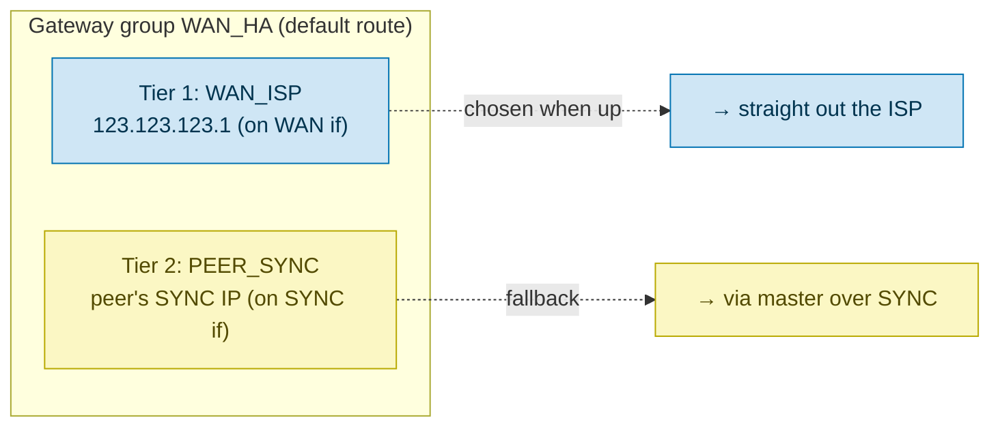
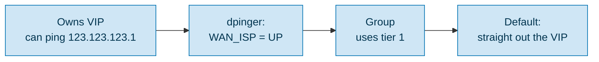
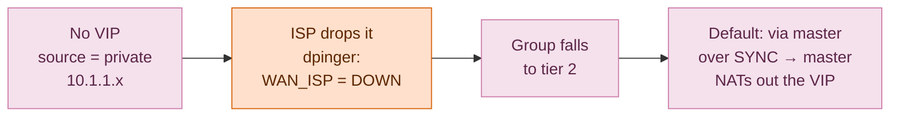
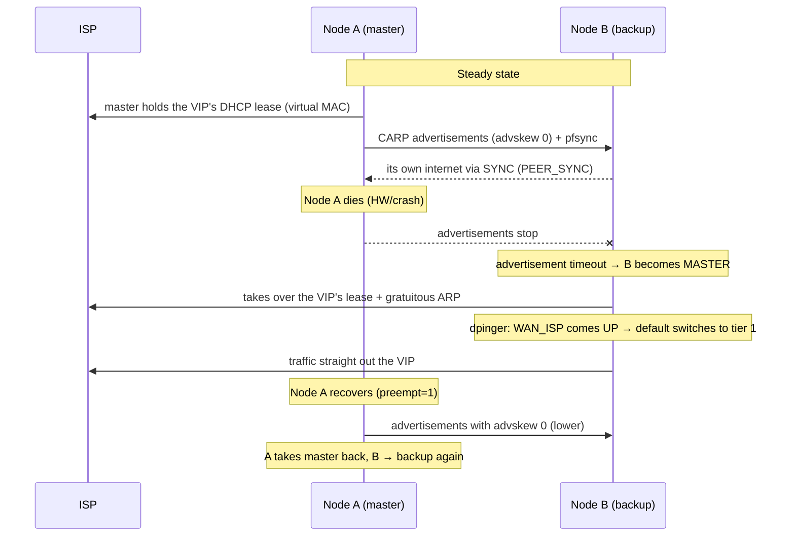

# CARP failover on a WAN with a single ISP-assigned IP

> **Status: THEORETICAL / UNTESTED.** A design write-up, not a validated recipe.
> The plugin mechanism (a DHCP lease kept alive on a CARP virtual MAC) is proven in
> production, but the full single-IP topology here — private per-node WAN IPs + a
> gateway group routing the backup's traffic through the master — has **not** been
> verified end to end. It *should* work; validate it in a lab first (see §11).

It uses the [os-carp-vip-dhcp](../README.md) plugin to keep the single public DHCP
lease alive on a virtual CARP MAC, so the address can float between two OPNsense
nodes — the classic "single-IP" obstacle to CARP on the WAN side.

All addresses below are **examples — substitute your own.** The private ranges are
[RFC 1918](https://datatracker.ietf.org/doc/html/rfc1918); the public side uses an
arbitrary, good-looking address (`123.123.123.123`) purely for illustration.

---

## 1  Goal and problem

**Goal:** seamless firewall failover (hot-warm HA) without depending on the ISP
handing out more than one IP.

**The problem:** classic CARP on a WAN wants **three** IPs on the WAN segment:

| IP | Role |
|----|------|
| Node A's own | Source for CARP advertisements + node A's own WAN access |
| Node B's own | Same, for node B |
| Floating VIP | The address services answer on / NAT out of |

Most ISPs give you **one** DHCP address (here: gateway `123.123.123.1`, one leased
public IP). That leaves you two short. This document works around that.

---

## 2  CARP mechanics (from `carp(4)`, FreeBSD + OpenBSD)

The facts that drive the design:

- **Failover mode is pure L2.** The master is elected via advertisements
  (multicast `224.0.0.18`) carrying `vhid`, `advbase`, `advskew` and a crypto
  checksum over the VIP prefixes + `pass`. Nodes only need **L2 adjacency** plus
  each other's presence.
- **`advskew` / `preempt`:** lowest `advskew` becomes master; `preempt=1` lets the
  intended master take the role back.
- **Auto-demotion:** FreeBSD raises `advskew` when a vhid interface goes down
  (`ifdown_demotion_factor=240`) or `pfsync` is out of sync → the master demotes
  itself → the backup takes over.
- **Virtual MAC** `00:00:5e:00:01:{vhid}`: the master answers ARP for the VIP with
  this address.
- **Important:** OpenBSD's warning that the carp device must share a subnet with
  the CARP VIP applies **only to `balancing` mode**. In ordinary master/backup,
  **a private node IP plus a public VIP in a different subnet is spec-valid** —
  that is exactly what we exploit.

---

## 3  Core idea

1. **The CARP VIP owns the single public IP**, obtained over DHCP on the **virtual
   CARP MAC** (`00:00:5e:00:01:{vhid}`) via the
   [os-carp-vip-dhcp](../README.md) plugin. The lease follows the master on
   failover.
2. **Each node is assigned a small private static IP** on the WAN interface — set
   by hand, not via DHCP — used only for CARP advertisements + node identity. The
   ISP never sees it (link-local multicast).
3. **The backup's own internet** is routed through the master over the SYNC link,
   driven by a **gateway group** whose gateway monitoring (dpinger) tracks the CARP
   role automatically (no `devd` hook needed).
4. **A WAN-front switch** (passive L2) gives both nodes access to the same WAN
   segment.

---

## 4  Topology


> Node A/B's private WAN IPs (`10.1.1.1/2`) are for CARP only. All real
> outbound traffic is NAT'd out of the VIP `123.123.123.123`.

---

## 5  IP plan (example addresses)

| Element | Value | Synced? | Note |
|---------|-------|---------|------|
| WAN public VIP | `123.123.123.123/24` (vhid 9) | Yes (VIP def) | Obtained via DHCP on virtual MAC `00:00:5e:00:01:09` |
| WAN gateway (ISP) | `123.123.123.1` | — | On-link via the VIP's /24 |
| Node A WAN private | `10.1.1.1/30` | No (per-node) | CARP advertisement source only |
| Node B WAN private | `10.1.1.2/30` | No (per-node) | — |
| SYNC subnet | `10.2.2.0/30` | — | pfsync + config-sync + transit |
| Node A SYNC | `10.2.2.1` | No (per-node) | — |
| Node B SYNC | `10.2.2.2` | No (per-node) | — |
| `advskew` A / B | `0` / `100` | No (per-node) | A is intended master, `preempt=1` |
| `pass` | shared secret | Yes | Authenticates advertisements on the shared segment |

> `vhid 9` → virtual MAC `00:00:5e:00:01:09` (last MAC byte = vhid in hex). In
> production pick an unusual vhid — see [§8 vhid collision](#8-open-questions-and-risks)
> about shared ISP L2.

---

## 6  The backup's internet — gateway group

The backup cannot reach `123.123.123.1` (it does not own the VIP), so it routes its
own traffic (pkg/NTP/DNS/dpinger) through the master over SYNC. **No hook** —
OPNsense's gateway monitoring (the *dpinger* daemon, configured as the gateway's
**Monitor IP** under _System → Gateways_) drives the switch by reachability.

### 6.1  One gateway group, two gateways, two interfaces



- **1 × WAN**, **1 × SYNC** — the two gateways live on separate interfaces. Not two
  WAN lines.
- `PEER_SYNC` points at the peer's **fixed** SYNC IP (A→`10.2.2.2`,
  B→`10.2.2.1`) — per-node config, avoids a "the VIP is local to me" loop.

### 6.2  Automatic role tracking

**The node that is MASTER** (owns the VIP):



**The node that is BACKUP** (does not own the VIP):



### 6.3  What the master needs to terminate the backup's traffic

| Element | Rule |
|---------|------|
| Outbound NAT | source `10.2.2.0/30` → translation = **WAN CARP VIP** (123.123.123.123), out the WAN |
| Firewall (SYNC) | allow `SYNC net → any` (keep it tight: pkg/NTP/DNS/dpinger) |
| Return | arrives at the VIP (master) → routed back to the backup's SYNC IP (`10.2.2.2`) on-link |

---

## 7  Failover flow



> **The failover speed is something _we_ set, not the ISP.** CARP declares a master
> dead after ~3 missed advertisements, so with `advbase 1` the switch is ~1–3 s
> (lower `advbase` = faster, at the cost of more advertisement chatter). The ISP
> only has to relearn the VIP's MAC on the new port (gratuitous ARP), which is
> near-instant.

---

## 8  Open questions and risks

- **`vhid` collision on a shared ISP L2:** if the ISP really shares L2 with other
  customers, `00:00:5e:00:01:{vhid}` could collide with another customer's
  VRRP/CARP. **Most fiber ISPs isolate customers per VLAN/port** (you only see gw
  `.1`) → safe. **Verify** with `tcpdump -T carp` + `arp -an` on the WAN before
  trusting it. Use an unusual `vhid` + a `pass` regardless.
- **`blockpriv`/`blockbogons` vs. CARP advertisements — should be fine:** a peer's
  advertisements arrive on the WAN with a **private/link-local source IP**
  (`10.1.1.x` → `blockpriv`). OPNsense installs a global `quick` rule that lets
  CARP past all blocks:
  ```
  pass log quick inet proto carp from any to 224.0.0.18 keep state
  ```
  `quick` is evaluated *before* `blockpriv`/`blockbogons`/default-deny, and it is
  interface-independent (`from any`), so it covers the WAN. Confirm with
  `pfctl -sr | grep carp` after the VIPs are set. (Observed on a working CGNAT
  two-node setup; **not** yet confirmed in this exact single-IP topology.)
- **Node IP:** the private node IP (`10.1.1.1/2`) is only the CARP advertisement
  source and never reaches the internet — the VIP does, via NAT. A `/30` RFC 1918
  link is the well-supported choice.
- **Gateway-monitor noise (dpinger):** the backup always logs `WAN_ISP` as DOWN —
  that *is* the mechanism, not a fault.
- **Failover transient:** connection states not covered by pfsync are lost across
  the switch. (In the niche run-only-on-master mode the new master must also re-DORA
  the lease, adding a few seconds.)
- **DHCP behaviour (must be tested):** does the ISP hand a lease to the virtual MAC,
  and does it restrict you to one active MAC? Some ISPs will happily lease a second
  address to a second MAC (in which case you do **not** need this single-IP design
  at all — just give each node its own lease). Others bind one lease per line.
  **Test safely** with a DHCP `DISCOVER`-only probe (e.g. a small Scapy script from
  the virtual MAC) before committing — a DISCOVER does not take a lease, so it will
  not disturb the live line.
- **Lab failure modes to watch:** return-path routing for the backup's SYNC-sourced
  traffic, dpinger flapping during role changes, and whether the ISP's DHCP server
  tolerates the virtual MAC.

---

## 9  Reality check

Both nodes share **one** physical WAN uplink, so backup WAN-gateway monitoring adds
no real HA value (if the WAN is down, it is down for both). The backup's internet
(§6) is a **convenience** (self-`pkg`/NTP), not an HA requirement — the backup can
skip it entirely and pull NTP/DNS/config from the master over SYNC, dropping §6.

---

## 10  Implementation steps (OPNsense GUI)

1. **WAN-front switch** physically between the ISP hand-off and both nodes' WAN
   ports.
2. **WAN if per node:** static private IP (`10.1.1.1/30` / `.2/30`).
3. **CARP VIP** `123.123.123.123/24`, vhid 9, `pass`, advskew 0/100 →
   _Interfaces → Virtual IPs_.
4. **Plugin** [os-carp-vip-dhcp](../README.md): a keeper on the VIP, `followIp=1`.
   Ungated gives seamless failover, but both nodes then periodically source the
   virtual MAC (DHCP renewals) on the shared WAN-front switch → MAC-table flap;
   **run-only-on-master** avoids that (only the master sources it) at the cost of a
   small DORA gap on failover. Choose per how your ISP/switch tolerates the MAC.
5. **SYNC if:** `10.2.2.1/30` / `.2/30`; pfsync + XMLRPC config-sync →
   _System → High Availability_.
6. **Gateways:** `WAN_ISP` (123.123.123.1, on WAN), `PEER_SYNC` (peer's SYNC IP, on
   SYNC) → _System → Gateways_.
7. **Gateway group** `WAN_HA` = `[WAN_ISP tier 1, PEER_SYNC tier 2]`; point the
   default route / floating policy at the group.
8. **Outbound NAT** (master role): `10.2.2.0/30` → the WAN VIP.
9. **Firewall (SYNC):** `SYNC net → any` (tight).
10. **Verify:** `tcpdump -T carp` (advertisements), a failover test (down the
    master NIC), dpinger switching tier, and the VIP lease following the master.

---

## 11  What is proven vs. unproven

| Piece | Status |
|-------|--------|
| Keeping a DHCP lease alive on a CARP virtual MAC (this plugin) | **Proven** in a two-node CGNAT setup |
| A CARP VIP whose address is DHCP-assigned, failing over between nodes | **Proven** (same setup) |
| Private per-node WAN IP as CARP-advertisement source only | Spec-valid per `carp(4)`; **not** validated in this exact topology |
| Gateway group routing the backup's own internet through the master | **Unproven** — design only |
| The whole single-IP topology, end to end | **Unproven** — validate in a lab |

If you try this, please open an issue with what worked and what did not — real
results will turn this from a plausible design into a tested recipe.
